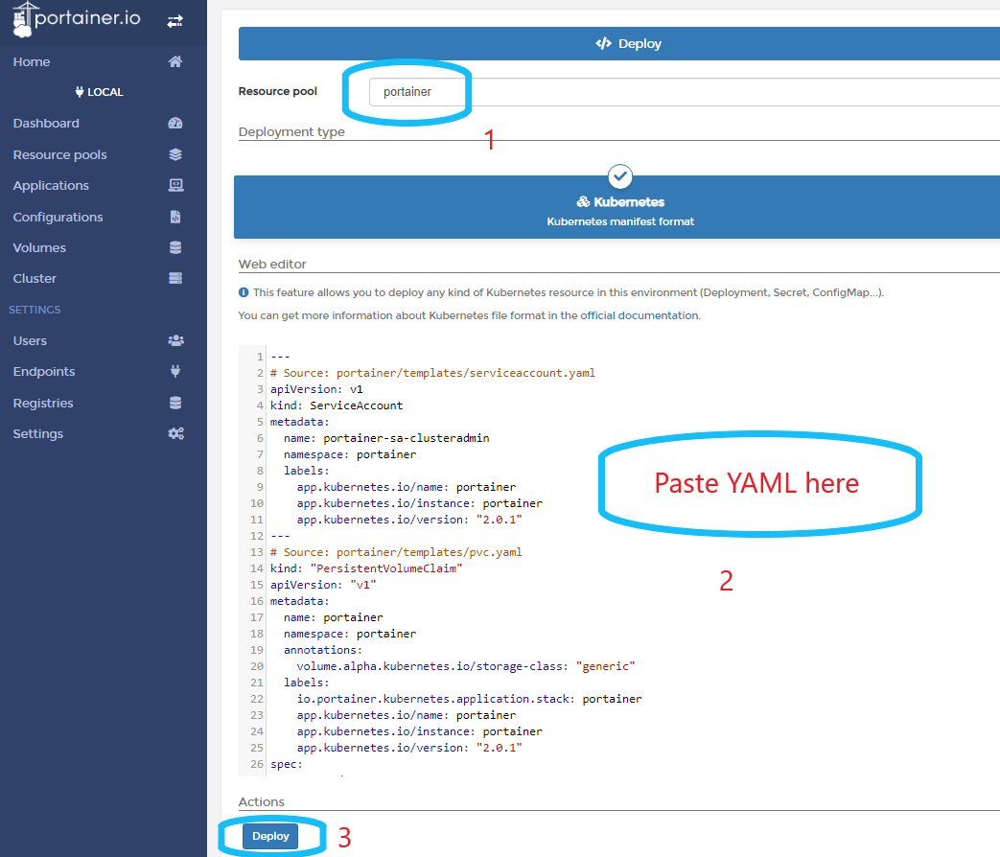

# :material-kubernetes: Upgrade Kubernetes Deployment

!!! Warning "Agent Versions"
    Always match the agent version to Portainer Server version. i.e., while installing or upgrading to Portainer 2.6 make sure all the agents are also version 2.6. 


Steps to upgrade Portainer and or Portainer agent deployed into Kubernetes. Upgrade method depends on the original install method used.

## Using Helm
Add Portainer helm repo running the following, ignore any warning about the repo being there already.
```shell
helm repo add portainer https://portainer.github.io/k8s/
```
```shell
helm repo update
```

Run the command below to upgrade to latest version of Portainer
```shell
helm upgrade -n portainer portainer portainer/portainer --reuse-values
```

## Using YAML Manifest

### Method 1:
Easiest way to upgrade is to use Portainer UI and use manifest files..

Copy the contents of manifest file from

#### For NodePort

```shell
https://raw.githubusercontent.com/portainer/k8s/master/deploy/manifests/portainer/portainer.yaml
```

> ##### Agent Only
>     https://raw.githubusercontent.com/portainer/k8s/master/deploy/manifests/agent/portainer-agent-k8s-nodeport.yaml

#### For LoadBalancer
```shell
https://raw.githubusercontent.com/portainer/k8s/master/deploy/manifests/portainer/portainer-lb.yaml
```

> ##### Agent Only
>     https://raw.githubusercontent.com/portainer/k8s/master/deploy/manifests/agent/portainer-agent-k8s-lb.yaml

Login to portainer, in Kubernetes endpoint where portainer is installed go to Applications --> Advanced Deployment. Paste the yaml content.


Paste the yaml content and click Deploy.
Portainer should come back to a login page in a few seconds.




### Method 2:

#### For NodePort
```shell
kubectl apply -n portainer -f https://raw.githubusercontent.com/portainer/k8s/master/deploy/manifests/portainer/portainer.yaml
```
> ##### Agent Only
>     kubectl apply -n portainer -f https://raw.githubusercontent.com/portainer/k8s/master/deploy/manifests/agent/portainer-agent-k8s-nodeport.yaml


#### For Load Balancer

```shell
kubectl apply -n portainer -f https://raw.githubusercontent.com/portainer/k8s/master/deploy/manifests/portainer/portainer-lb.yaml
```

> ##### Agent Only
>     kubectl apply -n portainer -f https://raw.githubusercontent.com/portainer/k8s/master/deploy/manifests/agent/portainer-agent-k8s-lb.yaml


Now you can go to portainer url and login. You should notice the new version number at the bottom left of Portainer UI.

!!! Tip "Force Update" 
    If portainer does not update after running the above commands, force the download of latest image by running the following:
    ```shell 
    kubectl -n portainer rollout restart deployment.apps/portainer
    ```

    or for Agent Only
    ```shell 
    kubectl -n portainer rollout restart deployment.apps/portainer-agent
    ```

## :material-note-text: Notes
[Contribute to these docs](https://github.com/portainer/portainer-docs/blob/master/contributing.md){target=_blank}
