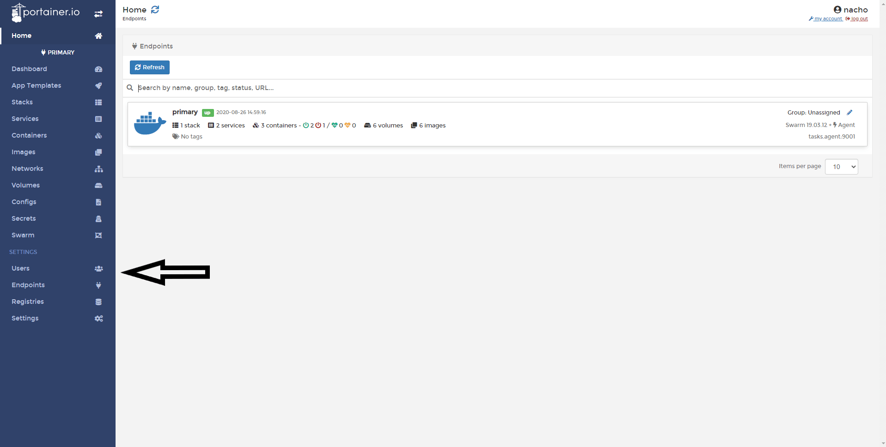
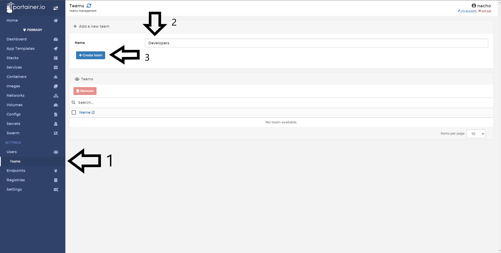

# Create a new team

The Team Management feature means that you can now assign users into teams, authorize teams to access endpoints, enable containers/services/volume management at the team level, and provide fine-grained access control.

## Creating a Team

To create a team in Portainer, select <b>Users</b>.

Then 1. select <b>Teams</b> 2.Type the name of Team and 3. click <b>Create Team</b>.

All teams created are listed

# Notes

[Contribute to these docs](https://github.com/portainer/portainer-docs/blob/master/contributing.md).