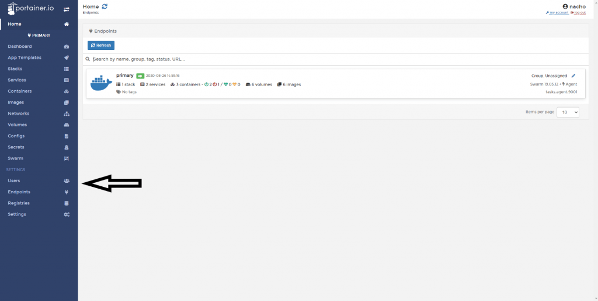
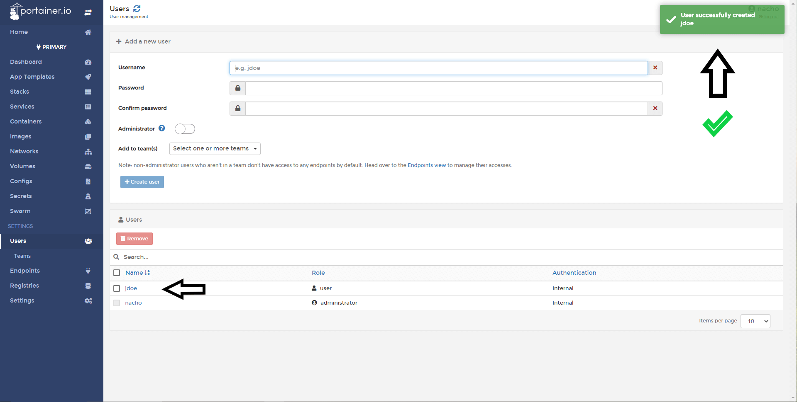

# Create a User

Portainer allows the management of users and access.

## Creating a User

Click <b>Users</b>

1. Type the username 2. pick a password (a strong one) and 3. click <b>Create User</b>.

## List all users

Confirmation at the top right shows on completion.

# Notes

[Contribute to these docs](https://github.com/portainer/portainer-docs/blob/master/contributing.md).