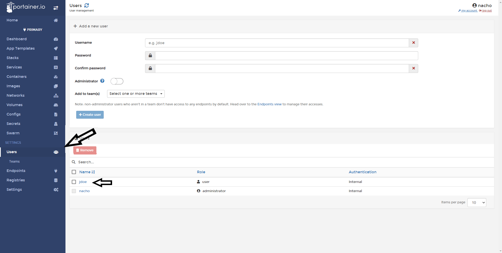
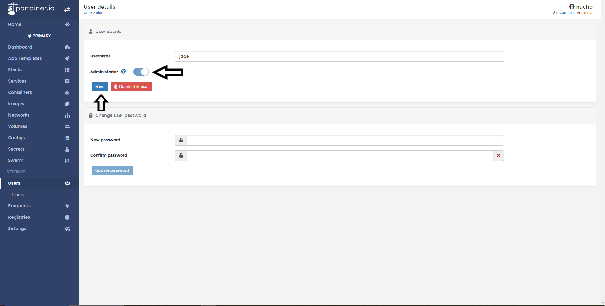
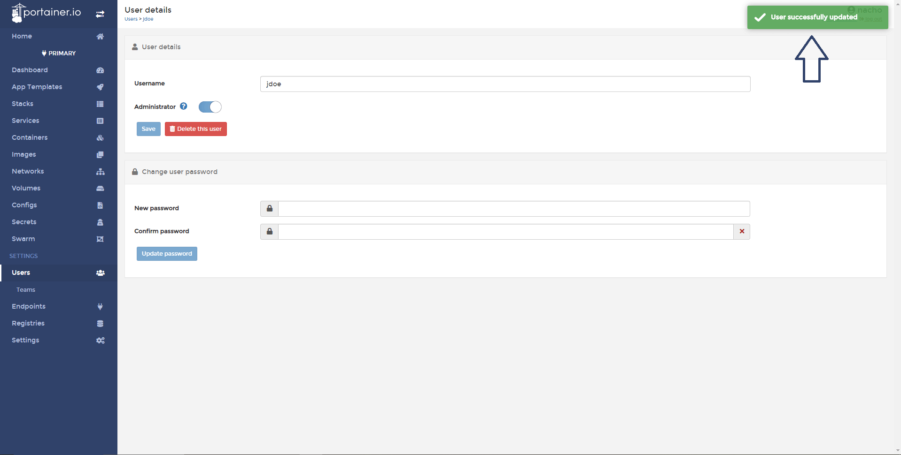
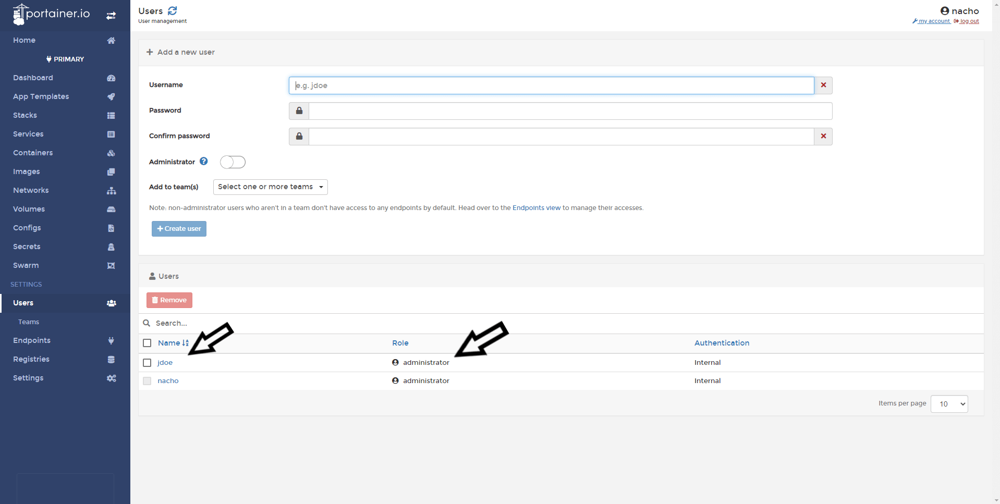

# How to promote a regular user to administrator

In this help article, you going to see, how to promote a regular user in the administrator of Portainer.

## Promoting a User to Administrator

Go and click in <b>Users</b> and choose what user you want to promote.

Enable the toggle <b>Administrator</b> in the following image and click in <b>Save</b>.

If everything goes well, you must see a confirmation pop up and also the user listed as Admnistrator.

#Notes

Do you think that is missing something here? Contribute with this admin guide forking the repo [Portainer-Docs](https://github.com/portainer/portainer-docs) and propose changes.