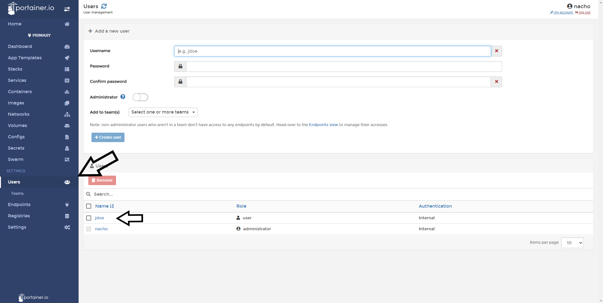
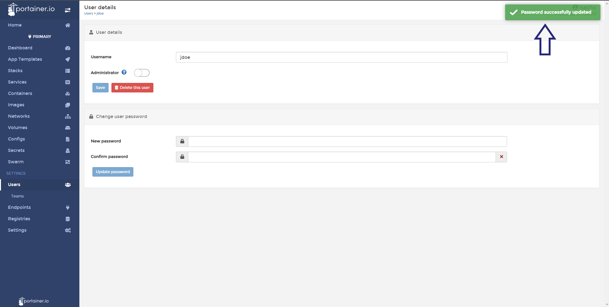

# How to change/reset user password

Select <b>Users</b> and then select the User who's password you would like to reset.

Set the new password (a strong one) and click <b>update password</b>.
You will see confirmation at the top right of screen if successful. 

# Notes

[Contribute to these docs](https://github.com/portainer/portainer-docs/blob/master/contributing.md){target=_blank}