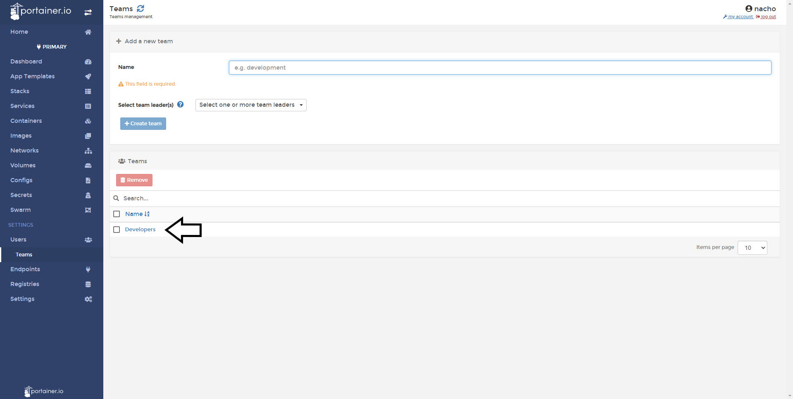
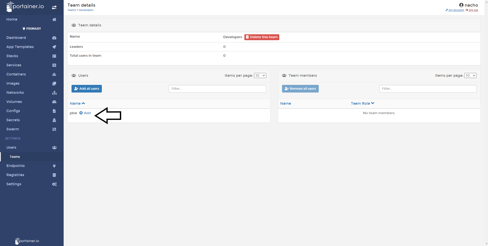

# Add a user to a team

In this help article, you will learn how to add a user to a team.

## Adding a User to a Team

The first step is to do a click in <b>Users</b> settings, do a click in <b>Teams</b> and choose the team that you want to add users.

Click in <b>Add</b> to add that user to the team.

It's done. The user is part of the team. You can confirm seeing in the list of Team Members.

# Notes

[Contribute to these docs](https://github.com/portainer/portainer-docs/blob/master/contributing.md).