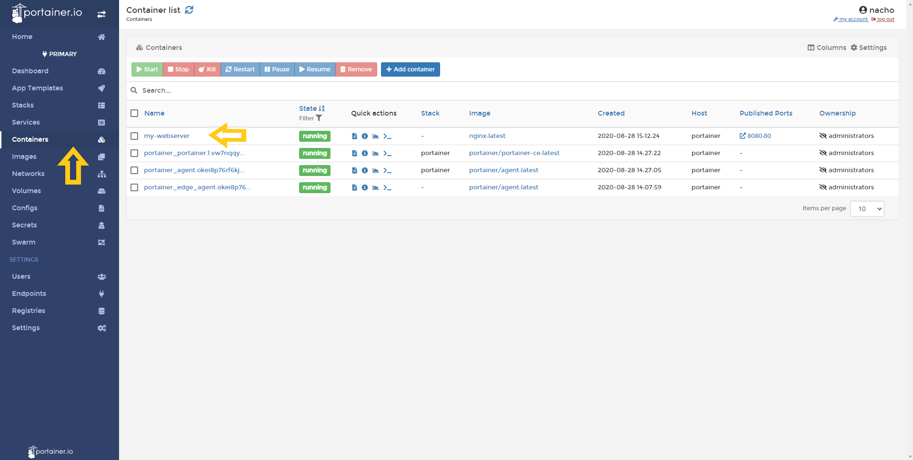
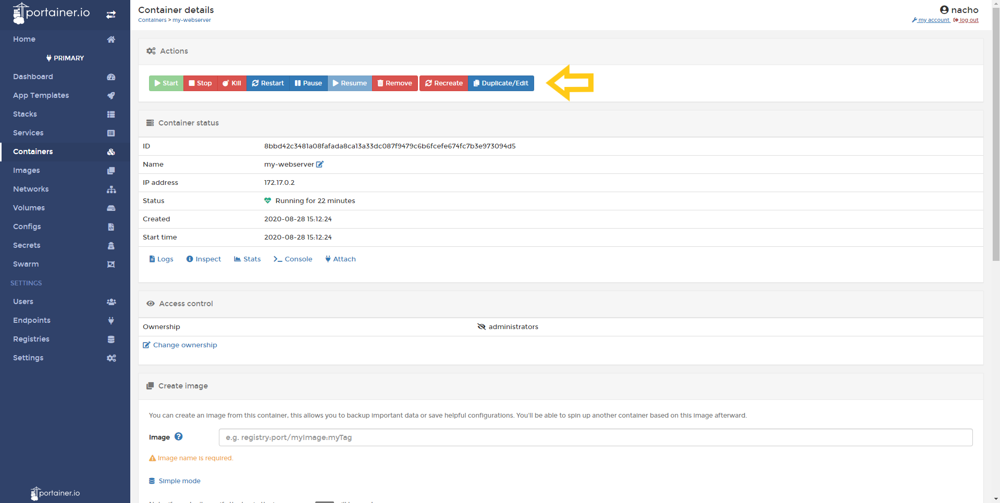
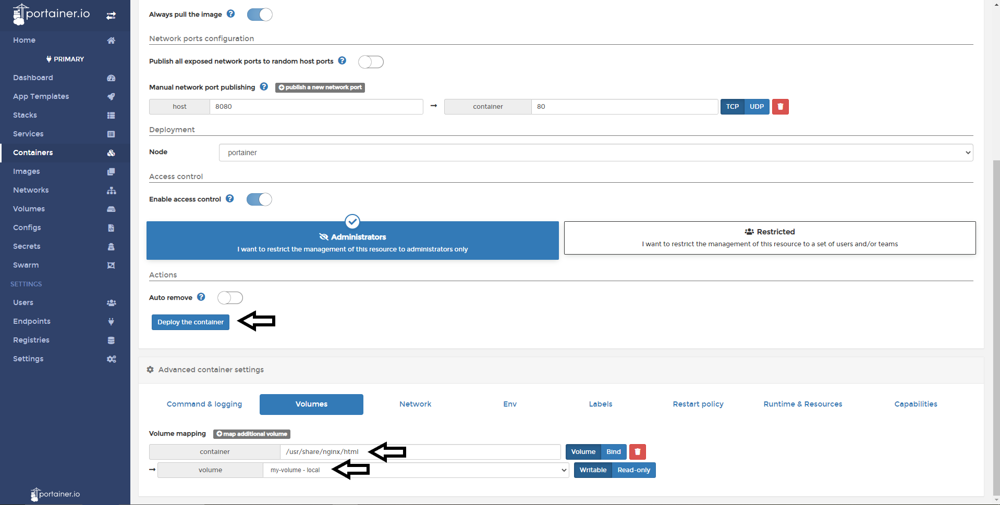
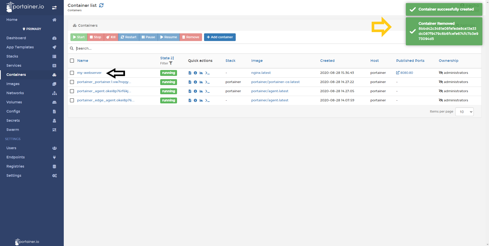
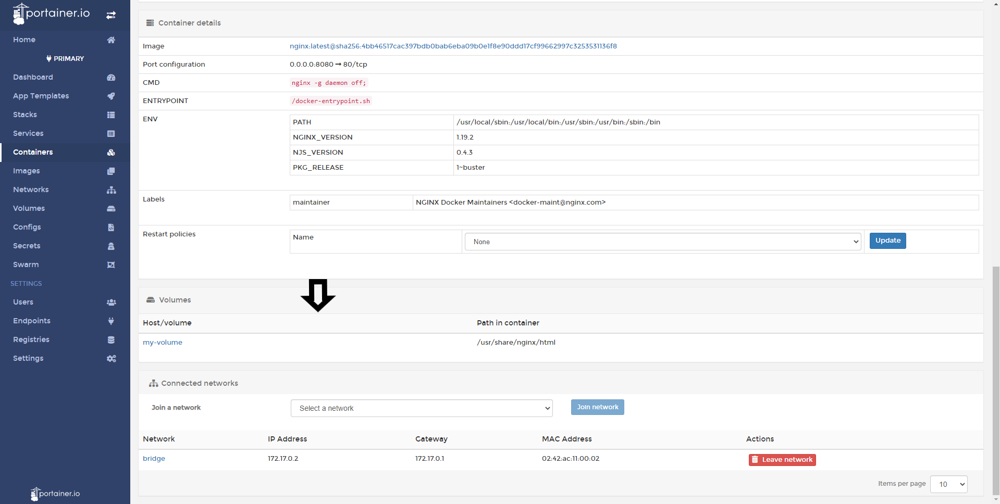

# Attach a existent volume to a Container

Portainer is capable to attach a new volume to a running container and in this help article, you will learn how to do it.

<b>Be advised that this operation destroys the running container and start a new one with the volume attached. Backup your data before doing this operation.</b>

## Attaching a volume

Once you logged in Portainer, you need to go to <b>Containers</b> option and select the <b>container</b> that you want to attach a volume.

The next step is doing a click in <b>Duplicate/Edit.</b>

Scroll down to the bottom to the page until the options for this container. Select Volumes and do a click in <b>Map an Additional Volume.</b>

The next thing is to type the path in the container, how you can see in this example, for an NGINX container, the path to persist is "/usr/share/nginx/html". Also, we need to specify the volume created.

Is all look good, the only thing you need to is click in <b>Deploy The Container</b>. You will receive the following warning:

Is everything worked as expected, you will have a confirmation pop up.

To confirm, click in your container, scroll down until you see volumes configuration. You will see something like this:

## Notes

Do you think that is missing something here? Contribute with this admin guide forking the repo [Portainer-Docs](https://github.com/portainer/portainer-docs) and propose changes.