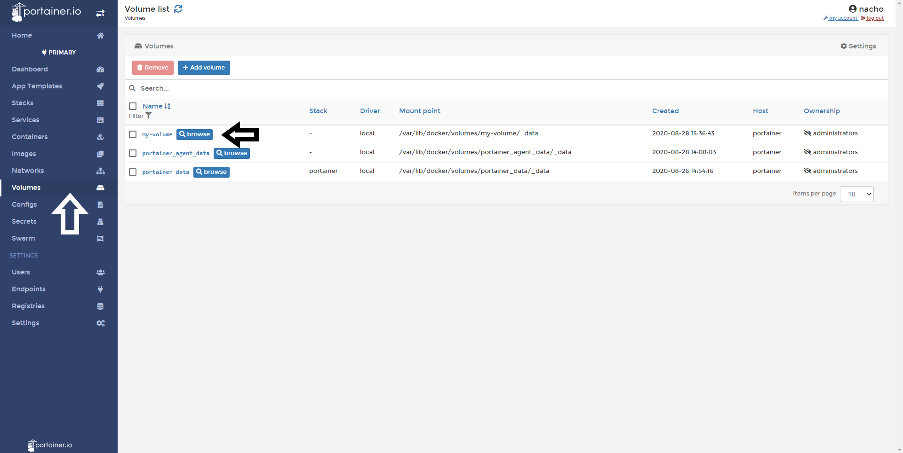
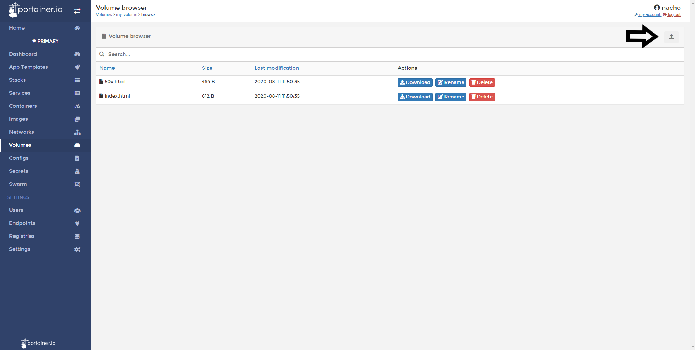

# Browse a volume

Portainer allows users to view volumes in Docker Swarm nodes.

## Browsing a Volume

Click <b>Volumes</b> from the side menu, and then click <b>browse</b> next to the volume you want to explore.

From this screen, you can upload files to this volume and expose it to the container quickly and without using a CLI.

## Notes

[Contribute to these docs](https://github.com/portainer/portainer-docs/blob/master/contributing.md).