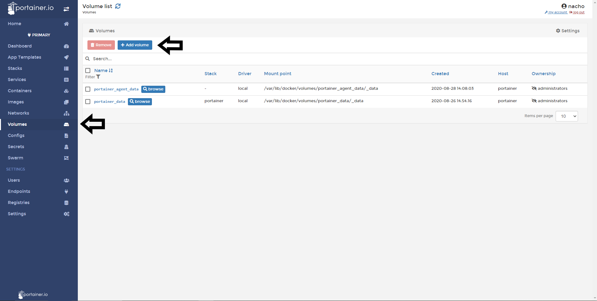
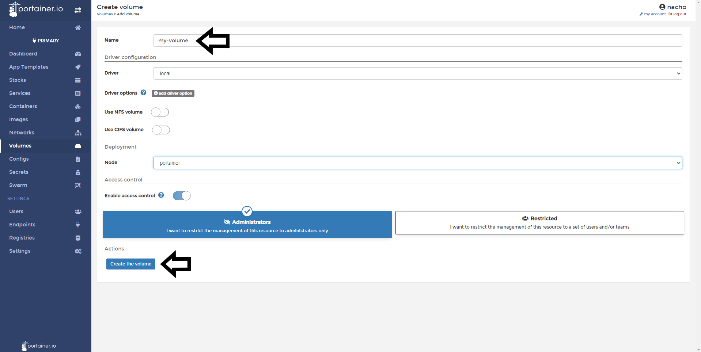
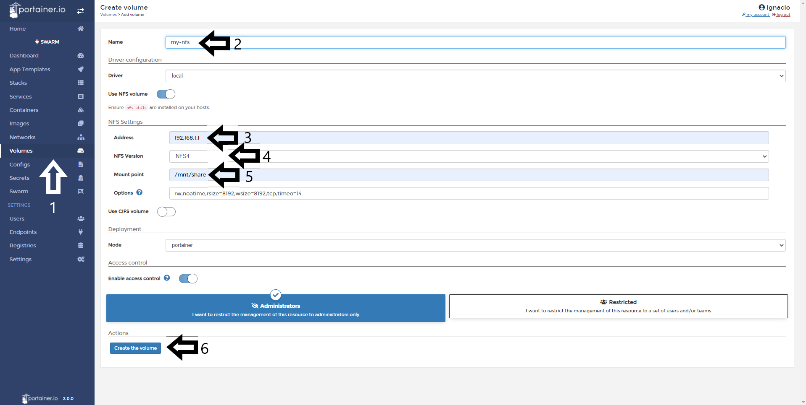
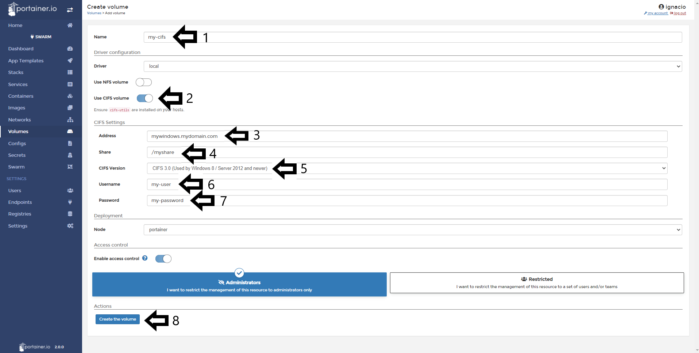

# How to create a new volume

Volumes are used to make persistent storage and you will able to manage them from Portainer. Note: Create a standalone volume is supported in a Docker Swarm and Docker Standalone endpoints.

In this help article, you will learn how to add/create a new volume.

## Creating a local volume

Once you logged in to Portainer, do a Click in the <b>Volumes</b> option in the menu and then do a click in <b>Create Volume</b>.

In this screen you have a few fields and options to fill. Let's see in details about those:

* Name: Name your volume with a descriptive name. 
* Driver Configuration: Local
* NFS: For using local volume, leave the toggle in off. 
* CIFS: For using local volume, leave the toggle in off.

Once its set up, do a click in <b>Create the Volume</b>

## Creating a NFS volume

In Portainer, you can mount a NFS volume and using to persist the data of your containers. To achieve this, go to <b>Volumes</b> and then do a click in <b>Create Volume.</b>

In this screen you have some options to choose and fields to fill. Let's see in details about those:

* Name: Name your volume with a descriptive name.
* Driver Configuration: Local
* NFS: Enable the toogle.

In NFS Settings section. You will find:

* Address: Type the hostname or IP address of your NFS Server.
* NFS Version: Choose the version of NFS that your NFS Server use.
* Mount Point: The path where that volume is mounted. Ex. /mnt/nfs01.
* Options: We recommend leave the default values in this field.

When is all set up, do a click in <b>Create the Volume</b>

## Creating a CIFS volume

In Portainer, you can mount a NFS volume and using to persist the data of your containers. To achieve this, go to <b>Volumes</b> and then do a click in <b>Create Volume.</b>

In this screen you have some options to choose and fields to fill. Let's see in details about those:

* Name: Name your volume with a descriptive name.
* Driver Configuration: Local
* NFS: Leave the toogle off.
* CIFS: Turn on the toogle.

In CIFS Settings section. You will find:

* Address: Type your CIFS Server name or IP Address.
* Share: Type the name of the share resource.
* CIFS Version: Pick the correct version of CIFS that you're using.
* Username: Your defined user to authenticate.
* Password: Your defined password to authenticate.

When is all set up, do a click in <b>Create the Volume</b>

## Notes

Do you think that is missing something here? Contribute with this admin guide forking the repo [Portainer-Docs](https://github.com/portainer/portainer-docs) and propose changes.