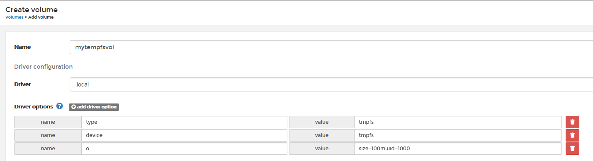
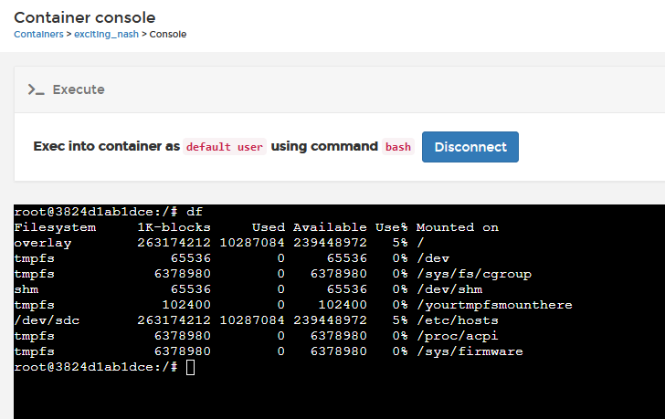

# How to create a new volume

Volumes are used to make persistent storage that you can manage from Portainer. 
Note: Creating a standalone volume is only supported in a Docker Swarm and Docker Standalone endpoints.

* [Creating a local volume](#creating-a-local-volume)
* [Creating an NFS volume](#creating-an-nfs-volume)
* [Creating a CIFS volume](#creating-a-cifs-volume)
* [Creating a tmpfs volume](#creating-a-tmpfs-volume)

## Creating a local volume

Click <b>Volumes</b> from the side menu and then click <b>Create Volume</b>.

Complete the detail fields for this volume:

* Name: Give your volume with a descriptive name
* Driver Configuration: Local
* NFS: For local volumes leave this off
* CIFS: For local volumes leave this off

Once complete, click <b>Create the Volume</b>.

## Creating an NFS volume

In Portainer, you can mount an NFS volume to persist the data of your containers. To achieve this, go to <b>Volumes</b> and then click <b>Create Volume.</b>

Complete the detail fields for this volume:

* Name: Give your volume with a descriptive name
* Driver Configuration: Local
* NFS: Enable this toggle

Under the NFS Settings section. You will find:

* Address: Type the hostname or IP address of your NFS Server.
* NFS Version: Choose the version of NFS that your NFS Server uses.
* Mount Point: The path where that volume is mounted. E.g. /mnt/nfs01.
* Options: We recommend leaving the default values in this field.

When this is complete click <b>Create the Volume</b>.

## Creating a CIFS volume

In Portainer, you can mount a CIFS volume to persist the data of your containers. To achieve this, go to <b>Volumes</b> and then click <b>Create Volume.</b>

Complete the detail fields for this volume:

* Name: Give your volume with a descriptive name.
* Driver Configuration: Local
* NFS: Leave this toggle off
* CIFS: Enable this toggle

In CIFS Settings section. You will find:

* Address: Type your CIFS Server name or IP Address
* Share: Type the name of the share resource
* CIFS Version: Pick the correct version of CIFS that you're using
* Username: Your defined user to authenticate
* Password: Your defined password to authenticate

When this is complete click <b>Create the Volume</b>.

## Creating a tmpfs volume

To create a tmpfs volume within Portainer, go to <b>Volumes</b> and then click on <b>Create volume</b>.

Complete the detail fields for this volume:

* Name: Give your volume a descriptive name.
* Driver configuration: 
    * Driver: local
    * Driver options: Click <b>add driver option</b> and add the following name/value combinations:
        * name: <code>type</code>  
          value: <code>tmpfs</code>
        * name: <code>device</code>  
          value: <code>tmpfs</code>
        * name: <code>o</code>  
          value: <code>size=100m,uid=1000</code>  (customize these values to suit your needs)

* NFS: Leave this toggle off
* CIFS: Leave this toggle off

Once complete, click <b>Create the Volume</b>.

This volume can now be attached to a container in the same way as any other volume:

Once attached, you can confirm the tmpfs volume has been mounted correctly within the container:

## :material-note-text: Notes

[Contribute to these docs](https://github.com/portainer/portainer-docs/blob/master/contributing.md){target=_blank}