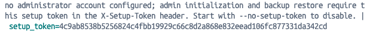
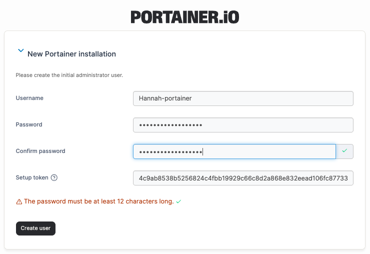

# How do I find, skip, or customize my setup token?

From Portainer version 2.43 / 2.39.4, new Portainer instances require a setup token to complete first-time setup. This token exists to protect a freshly started instance from being claimed by someone other than the intended administrator. The token only applies to brand-new instances with no administrator account, and to restoring Portainer from a backup. Existing deployments are unaffected.

### How do I retrieve my token?

Your setup token must be retrieved from your Portainer server logs. How you access your logs will depend on the environment that you have installed Portainer on. Run the relevant command in a terminal on the machine where Portainer is installed.

| Environment       | Command                   | Notes                                                                                              |
| ----------------- | ------------------------- | -------------------------------------------------------------------------------------------------- |
| Docker Standalone | `docker logs <container>` | Replace `<container>` with your Portainer container name or ID. Run `docker ps` to find it.        |
| Docker Swarm      | `docker logs <container>` | Replace `<container>` with your Portainer container name or ID. Run `docker ps` to find it.        |
| Podman            | `podman logs <container>` | Replace `<container>` with your Portainer container name or ID. Run `podman ps` to find it.        |
| Kubernetes        | `kubectl logs <pod_name>` | Replace `<pod_name>` with your Portainer pod name. Run `kubectl get pods -n portainer` to find it. |

Within your logs, you can find the setup token by searching for the following line: `setup_token=`. Copy the token and paste it into the **Setup token** field.

<figure><figcaption></figcaption></figure>

<figure><figcaption></figcaption></figure>

The setup token is one-time use, you do not need to store or remember it after setup is complete.

If the token is missing or incorrect, setup will be refused with an error directing you back to your server logs. Simply retrieve the token from your logs and try again. Note that the user must be created within 5 minutes [to ensure a secure setup](your-portainer-instance-has-timed-out-for-security-purposes-error-fix.md).&#x20;

### How can I skip or customize the setup token?

If the default behavior doesn't suit your deployment, you have a few options. Run one of the following on your initial Portainer installation:

`--setup-token <value>` - supply your own token instead of the auto-generated one. Useful for scripted or automated setup.

`--no-setup-token` - disables the token requirement entirely. Only use this when the instance runs on a network you fully control and trust, such as an isolated private or air-gapped network.

`--admin-password` / `--admin-password-file` - pre-set the administrator password at startup. No token is generated or required. This is the recommended approach for managed or marketplace installs where you may not have direct access to the server logs.
