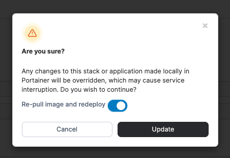

# Why do relative bind mounts appear empty after updating a stack that was deployed from Git?

When a stack deployed from a Git repository is updated, Portainer re-clones the repository if the commit has changed. This removes and recreates the repository directory on the host. If a container uses a relative path bind mount that points to files or directories inside the Git repository and that container is not recreated during the update, the bind mount can appear empty inside the container. This happens because the container is still referencing the previous filesystem path, which no longer exists after the repository is re-cloned.

Containers are only recreated when their Compose file or related configuration changes, unless [GitOps Updates with Force redeployment](../../../user/docker/stacks/add.md#option-3-git-repository) is enabled.

To ensure bind mounts are remounted correctly, [update the stack](../../../user/docker/stacks/edit.md) using **Pull and redeploy** with **Re-pull image and redeploy** enabled. This forces all containers in the stack to be recreated and remounts bind mounts against the newly cloned repository.

<figure><figcaption></figcaption></figure> <figure><figcaption></figcaption></figure>

