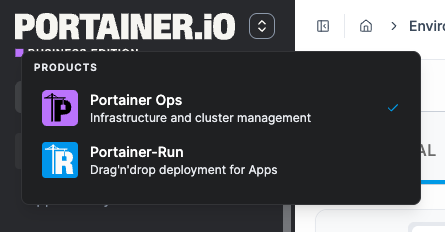

# Add-ons


Add-ons are only available to admin users in [Portainer Business Edition](https://www.portainer.io/business-upsell?from=addons) and require a local Kubernetes environment. For a full list of add-on requirements, [check out this FAQ](../../faqs/getting-started/add-on-requirements.md).


Portainer Add-ons are applications that extend Portainer. From this view, you can install and manage any available add-on applications. Add-ons are deployed as Helm releases into your local Kubernetes cluster and appear as separate tools in the sidebar switcher.

### Add-ons catalog

The catalog lists every add-on available and is updated dynamically from the [catalog URL](../settings/general.md#add-on-settings), so new and updated add-ons appear without updating Portainer. Each card shows the add-on's name, description, installed version, and current status, along with the actions available for that state.

These are the current add-ons listed in the default add-on catalog:

<table data-card-size="large" data-view="cards"><thead><tr><th></th><th></th><th data-type="content-ref"></th><th data-hidden data-card-cover data-type="image">Cover image</th></tr></thead><tbody><tr><td><h4>Portainer-Run</h4></td><td>Portainer-Run is a governed self-service layer that lets non-developer business teams deploy the apps they build with AI tools onto your organization's own Kubernetes, without ever needing to know anything about Kubernetes, containers, or infrastructure.</td><td><a href="https://docs.portainer.ai/portainer-run">https://docs.portainer.ai/portainer-run</a></td><td data-object-fit="contain"><a href="../../.gitbook/assets/portainer-run-svg.svg">portainer-run-svg.svg</a></td></tr><tr><td><h4>Portainer-Command</h4></td><td>Portainer-Command is the MCP gateway between your AI agent and your cluster; agents get expiring read-only sessions with a stated rationale, and every change arrives as a Git pull request that a person approves before Portainer applies it.</td><td><a href="https://docs.portainer.ai/portainer-command">https://docs.portainer.ai/portainer-command</a></td><td data-object-fit="fill"><a href="../../.gitbook/assets/favicon.svg">favicon.svg</a></td></tr><tr><td><h4>Portainer-IDP</h4></td><td>Portainer-IDP (Internal Developer Portal) lets developers deploy, scale, restart, roll back and monitor applications on Kubernetes without learning Kubernetes, inside guardrails your platform team sets once.</td><td><a href="https://docs.portainer.io/portainer-idp">https://docs.portainer.io/portainer-idp</a></td><td data-object-fit="fill"><a href="../../.gitbook/assets/Portainer-IDP.svg">Portainer-IDP.svg</a></td></tr><tr><td><h4>Portainer-Migrate</h4></td><td>Portainer-Migrate lets you migrate existing Docker and Swarm workloads to Kubernetes. It discovers your containers, Compose stacks, and Swarm services, translates them into Kubernetes manifests, commits them to a Git repository, and deploys them as Portainer GitOps stacks - one organized folder per environment.</td><td><a href="https://docs.portainer.io/portainer-migrate">https://docs.portainer.io/portainer-migrate</a></td><td data-object-fit="fill"><a href="../../.gitbook/assets/Portainer-Migrate.svg">Portainer-Migrate.svg</a></td></tr></tbody></table>


[installing-an-add-on.md](installing-an-add-on.md)



[managing-an-installed-add-on.md](managing-an-installed-add-on.md)


### Add-on switcher


Add-ons that are not healthy appear in the switcher but are shown as disabled - they cannot be launched until restored.


Click the product switcher icon in the sidebar to see all enabled add-ons as external links.

<figure><figcaption></figcaption></figure>
