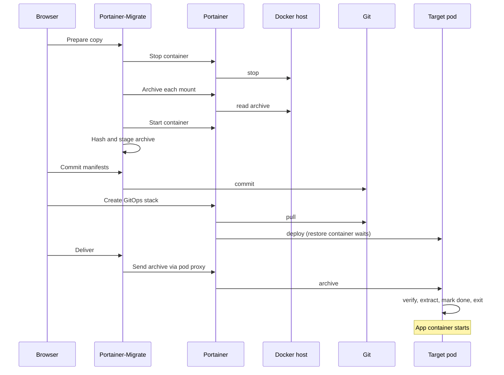

# How data copy works

Cold copy moves the contents of a Docker volume or bind mount into a new PersistentVolumeClaim on Kubernetes. It is built to keep the migrated workload GitOps-managed, and to need nothing beyond what Portainer already provides: no SSH access to hosts, no `kubectl`, no external storage and no public endpoint.

## The flow



## Snapshot

The add-on stops the source container through Portainer, giving it 60 seconds to shut down cleanly. While it is stopped, the add-on reads an archive of every mount being copied, using Portainer's Docker API proxy. It then starts the container again, but only if it was running before.

All of a container's mounts are archived during one stop, so they are consistent with each other. If another running container writes to the same volume or host path, the copy refuses to start.



## Staging

The add-on holds each archive on its temporary disk, with its size and SHA-256 checksum, and generates a one-time token for it. Staged archives share 2 GiB of space and expire after 30 minutes.



## Deployment

The committed manifests give each pod with copied data a **restore init container** (`python:3.13-alpine`). When Portainer deploys the stack, the restore container starts first and waits for its data on port 8080. Your application container doesn't start until it finishes.



## Delivery

The add-on sends each archive to its restore container through Portainer's Kubernetes pod proxy, using your Portainer session. The token goes in the request body, because the pod proxy strips custom headers.

The restore container:

* Checks the token, the length and the SHA-256 of what it received.
* Refuses any path or link that would escape the volume.
* Extracts the archive into the volume, keeping file ownership and permission bits.
* Writes a `.portainer-migrate-done` marker, acknowledges the delivery and exits.

The add-on then deletes its staged copy, and Kubernetes starts your application.



## Afterwards

If the pod is recreated, the restore container sees the marker and exits straight away, so the volume isn't overwritten. The restore container stays in the manifest in Git.



## Reliability

* **Long operations don't time out the browser.** Preparing and delivering a copy run as background jobs in the add-on. The browser starts the job and checks on it every two seconds.
* **Retries don't repeat work.** If a response is lost, retrying finds the existing job, so the source isn't stopped twice. **Retry data delivery** reuses the same snapshot and GitOps stack.
* **Lost acknowledgements are recovered.** If the restore succeeds but its reply is lost, the add-on sees the restore container's successful exit and completes without sending the data again.
* **Leaving the browser doesn't stop the source restart.** A snapshot keeps going if you close the tab, and the source is still started again. Delivery needs the page open.

Jobs and staged archives are held in memory and on temporary disk. If the add-on restarts, copies in progress are lost.

## Bind mounts

Bind-mounted directories and single files are copied the same way as volumes. The target gets a PersistentVolumeClaim, never a `hostPath`, so it doesn't need the source's host path. A single file is restored inside its claim and mounted at its original path with `subPath`. Read-only mounts stay read-only for the application; only the restore container writes to them.

Sockets, devices, symbolic-link mounts and a bind mount of `/` can't be copied. Bind mounts on Swarm services aren't supported.
