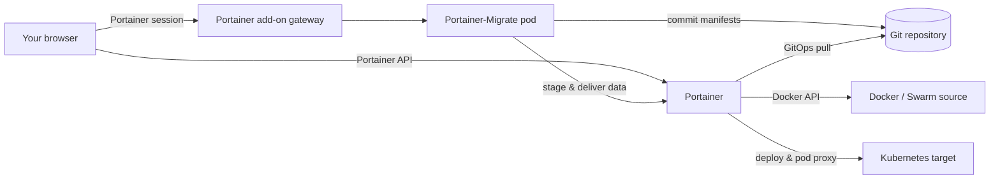

# Overview

Portainer-Migrate is a Portainer add-on: a small web application that Portainer installs on its own Kubernetes cluster and serves inside the Portainer interface. It doesn't have its own users, database or cluster credentials. Everything it does, it does with your Portainer session, and everything it deploys goes through Git.

## Design principles

* **Your Portainer session is the only identity.** The add-on runs on the same origin as Portainer, behind Portainer's add-on gateway, so every call it makes to Portainer carries your session. What you can migrate is exactly what your Portainer account can see and do.
* **Git is the only path to the cluster.** Portainer-Migrate never applies manifests to Kubernetes. It commits them to a repository and creates a Portainer GitOps stack, so every migrated workload is recorded in Git and deployed by Portainer like anything else you run with GitOps.
* **The translation is deterministic.** Workloads are converted by fixed rules, with no AI or external service involved. The same input gives the same output, and you review it before anything happens.
* **Nothing changes until you confirm.** The first four steps of the wizard only read. All changes happen when you click **Commit & deploy via GitOps**.

## Components

| Component               | Role                                                                                                                                                                                                  |
| ----------------------- | ----------------------------------------------------------------------------------------------------------------------------------------------------------------------------------------------------- |
| **The web app**         | Runs in your browser. Reads source workloads and target environments through the Portainer API, translates workloads to manifests, and drives the migration.                                          |
| **The add-on backend**  | A small Node.js server in the Portainer-Migrate pod. It does what the browser can't: talking to Git providers (so your token never has to be exposed to the page) and staging volume data for copies. |
| **Portainer**           | Lists environments and workloads, stops and starts source containers for a copy, stores the Git credential, creates the GitOps stack, and proxies data to the target pod.                             |
| **Your Git repository** | Holds the migrated manifests, one file per migration.                                                                                                                                                 |
| **The target cluster**  | Runs the migrated workloads, deployed by Portainer from Git.                                                                                                                                          |

## The migration flow



## Connections

The backend uses your token to list the repositories you can write to.



## Discover

The browser lists containers and Swarm services in the source environment through Portainer, and groups them into stacks by their Docker labels.



## Pre-flight

The browser lists the target's namespaces. The backend checks it can reach the Portainer API and the target, ready for any data copy.



## Translate

The browser inspects each selected container or service and generates the manifests.



## Migrate



If data is being copied, the backend stops each source container through Portainer, archives its mounts, starts it again, and holds the archive.



The backend commits the manifests to Git.



The browser asks Portainer to save a Git credential and create a Kubernetes GitOps stack that deploys the committed file.



Portainer pulls the file and applies it to the target.



If data is being copied, the backend sends each archive to the new pod's restore container through Portainer's Kubernetes pod proxy, and the app starts once the data is in place.



The browser watches the new pods and reports their health.



See [How data copy works](how-data-copy-works.md) for the details of step 5.



## What is stored, and where

| Data                                                              | Where                                                        | Lifetime                                |
| ----------------------------------------------------------------- | ------------------------------------------------------------ | --------------------------------------- |
| Migrated manifests                                                | Your Git repository                                          | Until you delete them.                  |
| Git token                                                         | A Portainer Git credential, and each GitOps stack's settings | Until you delete or change them.        |
| Git provider, server URL, username, repository, branch            | Your browser's local storage                                 | Until you clear site data.              |
| [History](/broken/pages/5bc07a8e01b5358ed5870fc6573276ea4174b1cc) | Your browser's local storage                                 | The last 50 runs.                       |
| Staged volume data                                                | The Portainer-Migrate pod's temporary disk                   | Until delivered, or 30 minutes at most. |

The add-on itself keeps no database and no persistent volume. Restarting it loses only copies in progress.

## The add-on pod

Portainer installs Portainer-Migrate with Helm into the `portainer-addon-portainer-migrate` namespace, which Portainer marks as a system namespace. The pod:

* Runs one replica as a non-root user, with a read-only root filesystem, all Linux capabilities dropped and the `RuntimeDefault` seccomp profile.
* Has no Kubernetes service account token. It has no access to any cluster's API of its own.
* Is exposed only as a ClusterIP Service, reached through Portainer's add-on gateway. It isn't reachable from outside the cluster.
* Has a 2 GiB temporary volume for staging copies.
