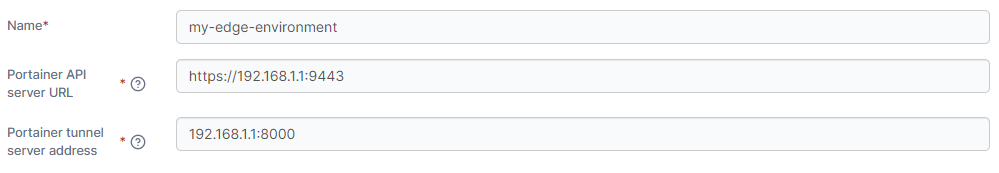
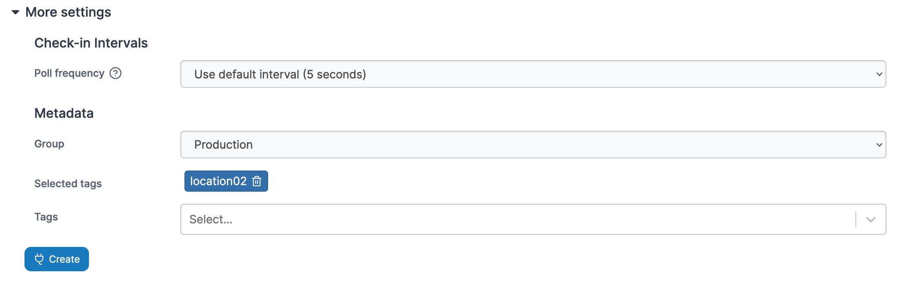

# Edge Agent

## Introduction

When a remote environment is not directly accessible from the Portainer Server instance, we recommend deploying the Portainer _Edge Agent_ to the remote environment. This allows you to manage the remote environment from your Portainer Server instance without having to open any ports on the environment. Rather than the traditional approach of the server connecting to Agents, the Edge Agent instead polls the Portainer Server periodically to see if there are any pending jobs to perform, and acts appropriately.


For a technical summary of how the Edge Agent works, refer to our [advanced documentation](../../advanced/edge-agent.md).


## Preparation

The Edge Agent requires two ports be open on the Portainer Server instance: the UI port (usually `9443` or `30779` on Kubernetes with NodePort) and the tunnel port ( `8000` or `30776` when using Kubernetes with NodePort). The tunnel port is used to provide a secure TLS tunnel between the Portainer Edge Agent and the Portainer Server instance. Our [installation instructions](../install/server/) configure Portainer Server to listen on both ports by default, and you will need to ensure your firewalling provides external access to these ports in order to proceed.


If your Portainer Server instance is deployed with TLS, the agent will use HTTPS for the connection it makes back to Portainer. However if your Portainer instance uses a self-signed certificate, the Edge Agent must be deployed with the `-e EDGE_INSECURE_POLL=1` flag. If you do not deploy the Edge Agent with this flag, then the agent will not be able to communicate with the Portainer Server instance.


In addition, our instructions assume your environment meets [our requirements](../requirements-and-prerequisites.md). While Portainer may work with other configurations, it may require configuration changes or have limited functionality.

## Deploying

To add an Edge Agent, click on **Environments** then **Add environment**.&#x20;

<figure><figcaption></figcaption></figure>

Select either **Docker Standalone**, **Docker Swarm** or **Kubernetes** depending on your environment type, then click **Start Wizard**. Then select the **Edge Agent** option. Enter the environment details **** using the table below as a guide.

| Field                           | Overview                                                                                                                                                                                                                                                                                                                                                                                                            |
| ------------------------------- | ------------------------------------------------------------------------------------------------------------------------------------------------------------------------------------------------------------------------------------------------------------------------------------------------------------------------------------------------------------------------------------------------------------------- |
| Name                            | Enter a name for your environment.                                                                                                                                                                                                                                                                                                                                                                                  |
| Portainer API server URL        | Enter the URL and port of your Portainer Server instance as it will be seen from your Edge environment. If using a FQDN, ensure that DNS is properly configured to provide this.                                                                                                                                                                                                                                    |
| Portainer tunnel server address | 
Enter the address and port of your Portainer Server instance's tunnel server as it will be seen from your Edge environment. If using a FQDN, ensure that DNS is properly configured to provide this. In most cases, this will be the same address as the Portainer API server URL, but without the protocol and on port <code>8000</code>. This field is only available in Portainer Business Edition.
 |

<figure><figcaption></figcaption></figure>

As an optional step you can expand the **More settings** section and adjust the Poll frequency for the environment - this defines how often this Edge Agent will check the Portainer Server for new jobs. The default is every 5 seconds. You can also categorize the environment by adding it to a [group](../../admin/environments/groups.md) or [tagging](../../admin/environments/tags.md) it for better searchability.

<figure><figcaption></figcaption></figure>

When you're ready, click **Create**. Then complete the new fields that have appeared using the table below as a guide.

| Field/Option            | Overview                                                                                                                                        |
| ----------------------- | ----------------------------------------------------------------------------------------------------------------------------------------------- |
| Environment variables   | Enter a comma separated list of environment variables that will be sourced from the host where the agent is deployed and provided to the agent. |
| Allow self-signed certs | Toggle this on to allow self-signed certificates when the agent is connecting to Portainer via HTTPS.                                           |

<figure><figcaption></figcaption></figure>

Choose your platform and environment where applicable, copy the generated command and run the command on your Edge environment to complete the installation. Alternatively if you are prestaging your Edge Agent, you can retrieve the join token here. You can also adjust the environment configuration from this page.&#x20;


If you have set a custom `AGENT_SECRET` on your Portainer Server instance you **must** remember to explicitly provide this when deploying your Edge Agent.


&#x20;If you have another Edge environment of the same type to deploy you can click **Add another environment** to do so. Otherwise if you have any other environments to configure click **Next** to proceed, or click **Close** to return to the list of environments.

