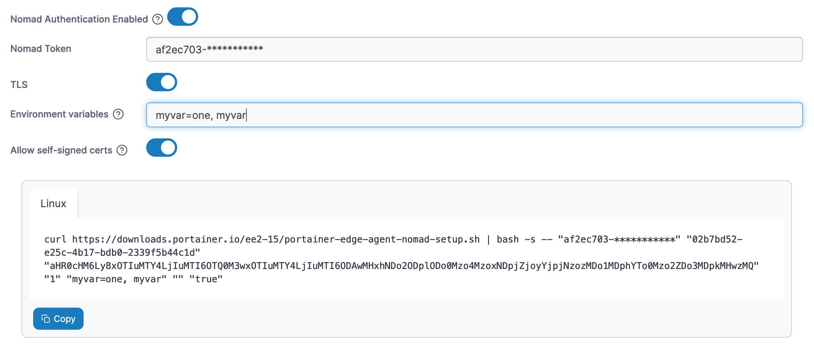

# Nomad

Nomad support in Portainer is provided through the use of the [Portainer Edge Agent](../../advanced/edge-agent.md).&#x20;

To add a Nomad environment, click on **Environments** then click the **Add environment** button.

<figure><figcaption></figcaption></figure>

Select **Nomad** as your environment type and click **Start Wizard**. Enter the **environment details** using the table below as a guide.

| Field                | Overview                                                                                                                                                                          |
| -------------------- | --------------------------------------------------------------------------------------------------------------------------------------------------------------------------------- |
| Name                 | Enter a name for your environment.                                                                                                                                                |
| Portainer server URL | Enter the URL and port of your Portainer Server instance as it will be seen from your Nomad environment. If using a FQDN, ensure that DNS is properly configured to provide this. |

<figure><figcaption></figcaption></figure>

As an optional step you can expand the **More settings** section and adjust the Poll frequency for the environment - this defines how often this Edge Agent will check the Portainer Server for new jobs. The default is every 5 seconds. You can also categorize the environment by adding it to a [group](../../admin/environments/groups.md) or [tagging](../../admin/environments/tags.md) it for better searchability.

<figure><figcaption></figcaption></figure>

When you're ready, click **Create**. Then complete the new fields that have appeared using the table below as a guide.

| Field/Option                 | Overview                                                                                                                                        |
| ---------------------------- | ----------------------------------------------------------------------------------------------------------------------------------------------- |
| Nomad Authentication Enabled | Toggle this on if your Nomad installation has ACL enabled (recommended).                                                                        |
| Nomad Token                  | If the above toggle is on, this field is displayed. Enter the Secret ID from your Nomad installation.                                           |
| TLS                          | Toggle this on if your Nomad installation uses TLS.                                                                                             |
| Environment variables        | Enter a comma separated list of environment variables that will be sourced from the host where the agent is deployed and provided to the agent. |
| Allow self-signed certs      | Toggle this on to allow self-signed certificates when the agent is connecting to Portainer via HTTPS.                                           |

<figure><figcaption></figcaption></figure>

Copy the generated command based on your settings and run it on your Nomad environment to deploy the Edge Agent.


If you have set a custom `AGENT_SECRET` on your Portainer Server instance you **must** remember to explicitly provide this when deploying your Edge Agent.


If you have another Nomad environment to deploy you can click **Add another environment** to do so. If you have any other non-Nomad environments to configure click **Next** to proceed, otherwise click **Close** to return to the list of environments.
