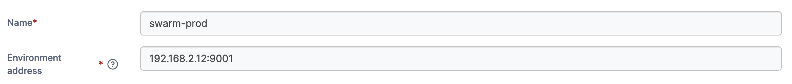
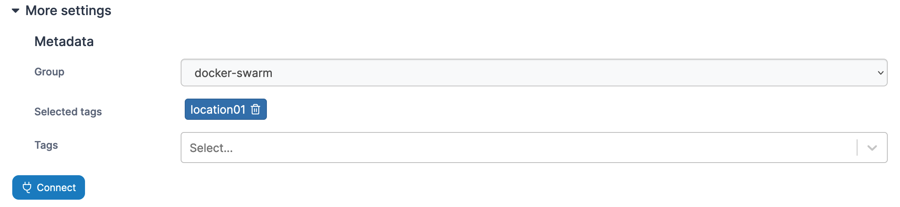

# Install Portainer Agent with Docker Swarm on Linux

## Introduction

Portainer uses the _Portainer Agent_ container to communicate with the _Portainer Server_ instance and provide access to the node's resources. This document will outline how to install the Portainer Agent on your node and how to connect to it from your Portainer Server instance. If you do not have a working Portainer Server instance yet, please refer to the [Portainer Server installation guide](../../install/server/swarm/linux.md) first.

To get started, you will need:

* The latest version of Docker installed and working.
* Swarm mode enabled and working, including the overlay network for the swarm service communication.
* `sudo` access on the manager node of your swarm cluster.
* The manager and worker nodes must be able to communicate with each other over port `9001`. In addition, the Portainer Server installation must be able to reach the nodes on port `9001`. If this is not possible, we advise looking at the [Edge Agent](../edge.md) instead.

The installation instructions also make the following assumptions about your environment:

* Your environment meets [our requirements](../../requirements-and-prerequisites.md). While Portainer may work with other configurations, it may require configuration changes or have limited functionality.
* You are accessing Docker via Unix sockets. Connecting via TCP is not supported in Docker Swarm.
* SELinux is disabled on the machine running Docker.
* Docker is running as root. Portainer with rootless Docker has some limitations, and requires additional configuration.
* If your nodes are using DNS records to communicate, that all records are resolvable across the cluster.
*   You have not set a custom `AGENT_SECRET` on your Portainer Server instance. If you have, you will need to provide that secret to your agent by adding it to the stack file:

    `environment:`

    &#x20; `- AGENT_SECRET: yoursecret`

## Deploying the Agent


Only do this **once** for your environment, regardless of how many nodes are in the cluster. You do **not** need to add each node as an individual environment in Portainer. Adding just one node (we recommend the manager node) will allow Portainer to manage the entire cluster. Adding each node as a separate environment will also consume more of your licensed node count than you may expect.


From the menu select **Environments** then click **Add environment**.

<figure><figcaption></figcaption></figure>

Next, select **Docker Swarm** as the environment type then click **Start Wizard**. Select the **Agent** option and the **Linux & Windows WSL** tab. Copy the command, then run it on the manager node of your Docker Swarm cluster.


You must run the command on the Docker Swarm cluster before entering the environment details.


<figure><figcaption></figcaption></figure>

The deployment command will return something similar to:

```
Creating network portainer-agent_portainer_agent
Creating service portainer-agent_agent
```

To validate the Agent is running, you can run the following command:

```
 docker service ls
```

the result of which should look something like this:

```
ID                  NAME                    MODE                REPLICAS            IMAGE                    PORTS
tshb6ee2710s        portainer-agent_agent   global              1/1                 portainer/agent:latest
```

Once the Portainer Agent has been successfully deployed on the cluster, you can complete the rest of the environment configuration.

## Finishing the configuration

Once the Agent is running on the Docker Swarm cluster, enter the **environment details** using the table below as a guide.


Only do this **once** for your environment, regardless of how many nodes are in the cluster. You do **not** need to add each node as an individual environment in Portainer. Adding just one node (we recommend the manager node) will allow Portainer to manage the entire cluster. Adding each node as a separate environment will also consume more of your licensed node count than you may expect.


| Field               | Overview                                                                                                                |
| ------------------- | ----------------------------------------------------------------------------------------------------------------------- |
| Name                | Give the environment a descriptive name.                                                                                |
| Environment address | Enter the IP or DNS name at which the Portainer Server instance can reach the environment along with the port (`9001`). |

<figure><figcaption></figcaption></figure>

As an optional step you can expand the **More settings** section and categorize the environment by adding it to a [group](../../../admin/environments/groups.md) or [tagging](../../../admin/environments/tags.md) it for better searchability.

<figure><figcaption></figcaption></figure>

When you're ready, click **Connect**. If you have other environments to configure click **Next** to proceed, otherwise click **Close** to return to the list of environments.

