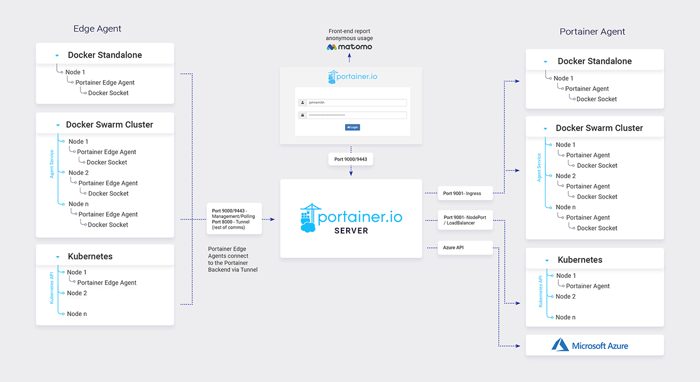

# Portainer architecture

## Overview of Portainer architecture

Portainer consists of two elements: the Portainer Server and the Portainer Agent. Both run as lightweight containers on your existing containerized infrastructure. The Portainer Agent should be deployed to each node in your cluster and configured to report back to the Portainer Server container.


For a deeper dive into the architecture of Portainer, have a look at our [reference architecture](https://academy.portainer.io/architecture).


A single Portainer Server will accept connections from any number of Portainer Agents, providing the ability to manage multiple clusters from one centralized interface. To do this, the Portainer Server container requires data persistence. The Portainer Agents are stateless, with data being shipped back to the Portainer Server container.


We don't currently support running multiple instances of the Portainer Server container to manage the same clusters. We recommend running the Portainer Server on a specific management node, with Portainer Agents deployed across the remaining nodes.


## Agent vs Edge Agent

In standard deployments, the central Portainer Server instance and any environments it manages are assumed to be on the same network, that is, Portainer Server and the Portainer Agents are able to seamlessly communicate with one another. However, in configurations where the remote environments are on a completely separate network to Portainer Server, say, across the internet, historically we would have been unable to centrally manage these devices.

With the new Edge Agent, we altered the architecture. Rather than the Portainer Server needing seamless access to the remote environment, only the remote environments need to be able to access the Portainer Server. This communication is performed over an encrypted TLS tunnel. This is important in Internet-connected configurations where there is no desire to expose the Portainer Agent to the internet.

## Security and compliance

Portainer runs exclusively on your servers, within your network, behind your own firewalls. As a result, we do not currently hold any SOC or PCI/DSS compliance because we do not host any of your infrastructure. You can even run Portainer completely disconnected (air-gapped) without any impact on functionality.

While we do (optionally) collect anonymous usage analytics from Portainer installations, we remain compliant with GDPR. Data collection can be disabled when you install the product, or at any time after that. If your installation is air-gapped, collection will silently fail without any adverse effects.


[requirements-and-prerequisites.md](requirements-and-prerequisites.md)

