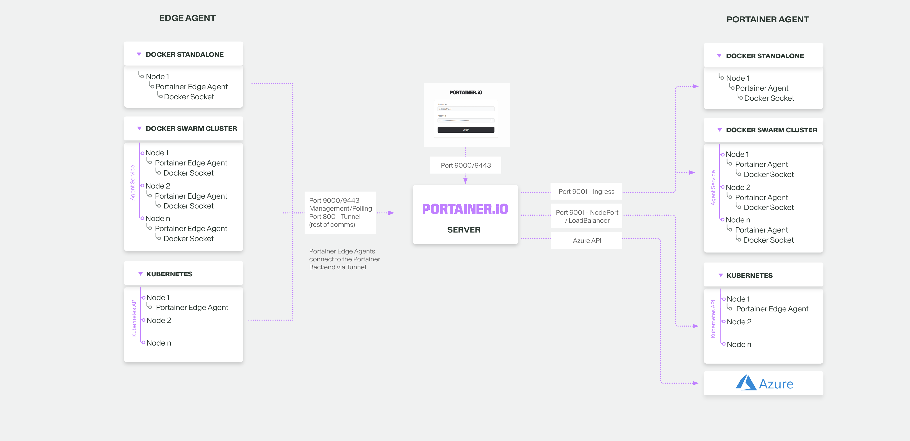

---
metaLinks:
  alternates:
    - https://app.gitbook.com/s/j6QEqM3Sd94bdPsX4HaN/start/architecture
---

# Portainer architecture

## Overview of Portainer architecture

Portainer consists of two elements: the Portainer Server and the Portainer Agent. Both run as lightweight containers on your existing containerized infrastructure. The Portainer Agent should be deployed to each node in your cluster and configured to report back to the Portainer Server container.


For a deeper dive into the architecture of Portainer, have a look at our [technical architecture overview](https://dl.portainer.io/dl/whitepapers/portainer-technical-architecture.pdf).


A single Portainer Server will accept connections from any number of Portainer Agents, providing the ability to manage multiple clusters from one centralized interface. To do this, the Portainer Server container requires data persistence. The Portainer Agents are stateless, with data being shipped back to the Portainer Server container.

<figure><figcaption></figcaption></figure>


We don't currently support running multiple instances of the Portainer Server container to manage the same clusters. We recommend running the Portainer Server on a specific management node, with Portainer Agents deployed across the remaining nodes.


## Agent vs Edge Agent

In most instances we recommend using the Edge Agent rather than the classic Agent when managing environments. With the Edge Agent, rather than the Portainer Server needing seamless access to the remote environment, only the remote environments need to be able to access the Portainer Server. This communication is performed over an encrypted TLS tunnel. This is important in Internet-connected configurations where there is no desire to expose the Portainer Agent to the internet.

In contrast, in classic Agent deployments the central Portainer Server accesses the environments, i.e. Portainer → Agents. As such, any environments it manages are assumed to be on the same network as the Portainer Server so it can securely communicate with Portainer Agents.

The classic Agent option remains for legacy purposes, and can still be used for local network scenarios, but it is worth noting that features such as Fleet Governance Policies are not available with the classic Agent.

## Security and compliance

Portainer runs exclusively on your servers, within your network, behind your own firewalls. As a result, we do not currently hold any SOC or PCI/DSS compliance because we do not host any of your infrastructure. You can even run Portainer completely disconnected (air-gapped) without any impact on functionality.


[lifecycle.md](lifecycle.md)

