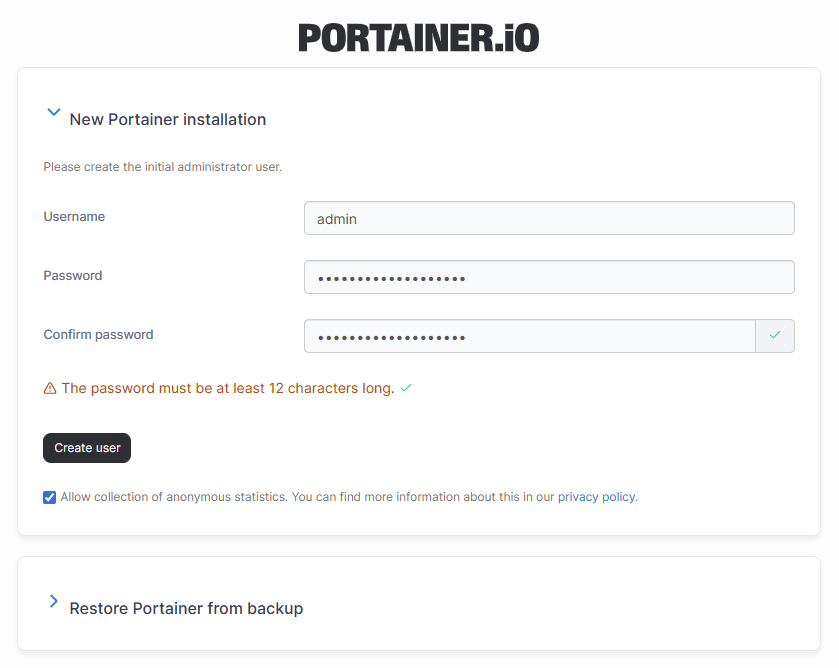
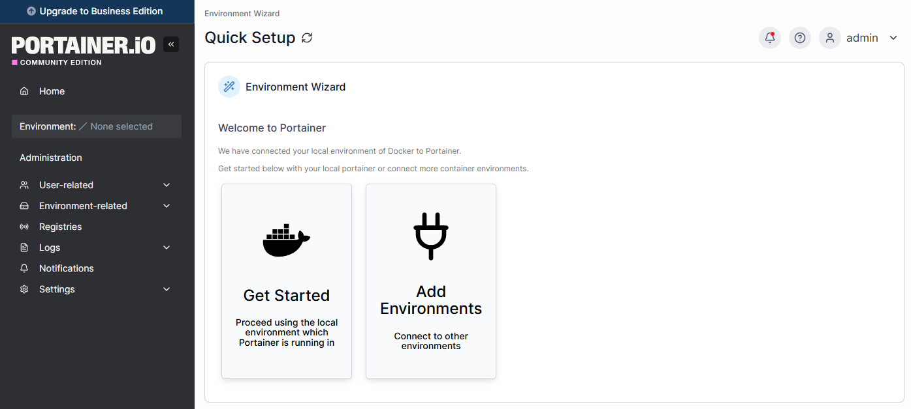

---
metaLinks:
  alternates:
    - >-
      https://app.gitbook.com/s/MdgxA76kWxcRmwybM8Ft/start/install-ce/server/setup
---

# Initial setup

Once the Portainer Server has been deployed, and you have navigated to the instance's URL, you are ready for the initial setup.

## Creating the first user

Your first user will be an administrator. The username defaults to `admin` but you can change it if you prefer. The password must be at least 12 characters long and meet the listed password requirements.

<figure><figcaption></figcaption></figure>

## Connecting Portainer to your environments

Once the admin user has been created, the **Environment Wizard** will automatically launch. The wizard will help get you started with Portainer.

<figure><figcaption></figcaption></figure>

The installation process automatically detects your local environment and sets it up for you. If you want to add additional environments to manage with this Portainer instance, click **Add Environments**. Otherwise, click **Get Started** to start using Portainer!
