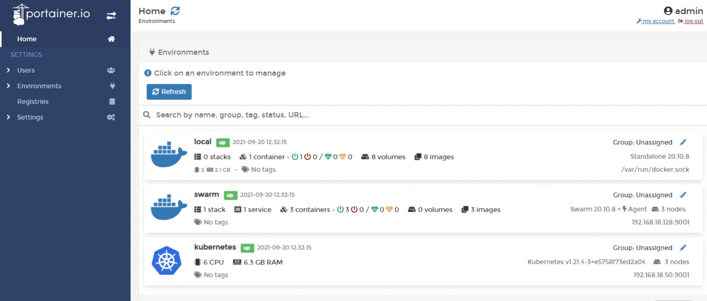

# Azure ACI

Before connecting to your Azure subscription, you need to create an Azure AD application. For more information on this please refer to the [official Microsoft documentation](https://docs.microsoft.com/en-us/azure/active-directory/develop/howto-create-service-principal-portal).


The following ACI features are not currently supported:

* ACI Persistent Storage
* Private networks


To add an ACI Endpoint, click on **Environments** then click the **Add environment** button. Then select **Azure**.

From here, fill in the details:

* **Name:** A descriptive name for this endpoint.
* **Application ID:** This value is from the application you created in Azure and can be found on the **Overview** page of your application within the Azure Portal.
* **Tenant ID:** You can get your tenant ID from the Overview page of your application within the Azure Portal.
* **Authentication key:** The client secret providing access to your Azure AD application. This can be created under **Certificates & secrets** within your application in the Azure Portal.

In the **Metadata** section, you can define a [Group](../../../admin/environments/groups.md) and [Tags](../../../admin/environments/tags.md) for this environment.

Once you have filled in the relevant details click **Add environment**.
