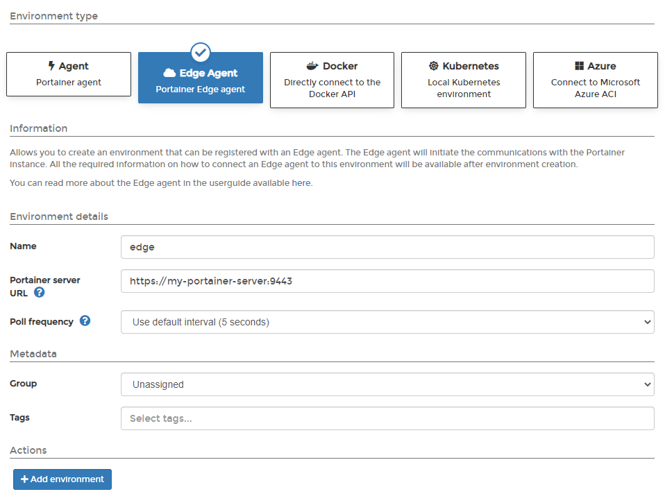
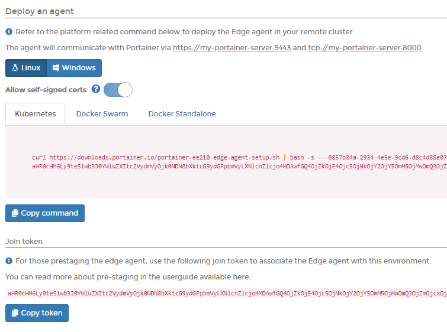
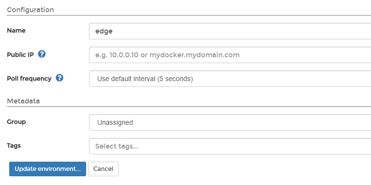

# Edge Agent

## Introduction

When a remote environment is not directly accessible from the Portainer Server instance, we recommend deploying the Portainer _Edge Agent_ to the remote environment. This allows you to manage the remote environment from your Portainer Server instance without having to open any ports on the environment. Rather than the traditional approach of the server connecting to Agents, the Edge Agent instead polls the Portainer Server periodically to see if there are any pending jobs to perform, and acts appropriately.


For a technical summary of how the Edge Agent works, refer to our [advanced documentation](../../../advanced/edge-agent.md).


## Preparation

The Edge Agent requires two ports be open on the Portainer Server instance: `9443` (which is used by the Portainer UI and in most cases is open) and `8000`. Port `8000` is used to provide a secure TLS tunnel between the Portainer Edge Agent and the Portainer Server instance. Our [installation instructions](../server/) configure Portainer Server to listen on both ports by default, and you will need to ensure your firewalling provides external access to these ports in order to proceed.


If your Portainer Server instance is deployed with TLS, the agent will use HTTPS for the connection it makes back to Portainer. However if your Portainer instance uses a self-signed certificate, the Edge Agent must be deployed with the `-e EDGE_INSECURE_POLL=1` flag. If you do not deploy the Edge Agent with this flag, then the agent will not be able to communicate with the Portainer Server instance.


In addition, our instructions assume your environment meets [our requirements](../../requirements-and-prerequisites.md). While Portainer may work with other configurations, it may require configuration changes or have limited functionality.

## Deploying

Log into your Portainer Server UI as an administrator and click on **Environments** in the left hand menu, then under **Environment type** select **Edge Agent**.

The **Name** should be a human-recognizable name for the environment and is how it will appear in the Portainer UI. The **Portainer server URL** is the URL the Edge Agent will connect to, so this must be resolvable from the Edge Agent. If using a FQDN, ensure that DNS is properly configured to provide this.

You can adjust the **Poll frequency** to suit your requirements - this defines how often this Edge Agent will check the Portainer Server for new jobs. The default is every 5 seconds. You can also assign this environment to a **Group** or add **Tags**.

When you have completed the form, click the **Add environment** button. This will create the environment within your Portainer Server instance and you will be taken to the Environment Details page for the environment.

Your next step will now be to deploy the Edge Agent in your cluster. Choose your platform and environment in the first section and you'll be provided with the relevant installation commands. Run this on your remote environment to complete the installation. Alternatively if you are prestaging your Edge Agent, you can retrieve the join token here. You can also adjust the environment configuration from this page.&#x20;


If you have set a custom `AGENT_SECRET` on your Portainer Server instance you **must** remember to explicitly provide this when deploying your Edge Agent.


Once the Edge Agent has been deployed on the remote cluster and the cluster has checked in with your Portainer Server instance, you're ready to go.
