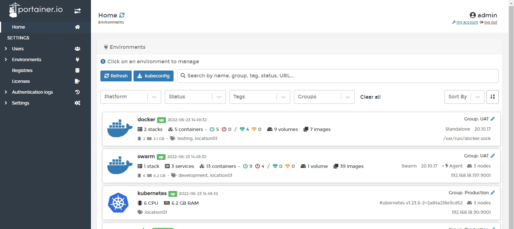

# KaaS

Portainer supports the provisioning of new Kubernetes environments on select cloud providers directly from within the interface, allowing you to spin up a new cloud Kubernetes environment and deploy the Portainer Agent with a few clicks.


This feature is only available in [Portainer Business Edition](https://www.portainer.io/business-upsell?from=kaas-provisioning).


To get started, select **Environments** from the left hand menu then click **Add Environment**.&#x20;

From the wizard select the **KaaS** option and click **Start Wizard**. Then, select your provider. We currently support the following providers:


[civo.md](civo.md)



[linode.md](linode.md)



[digitalocean.md](digitalocean.md)



[gke.md](gke.md)



[eks.md](eks.md)



[aks.md](aks.md)

