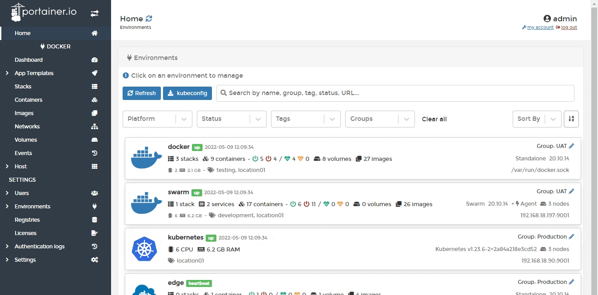
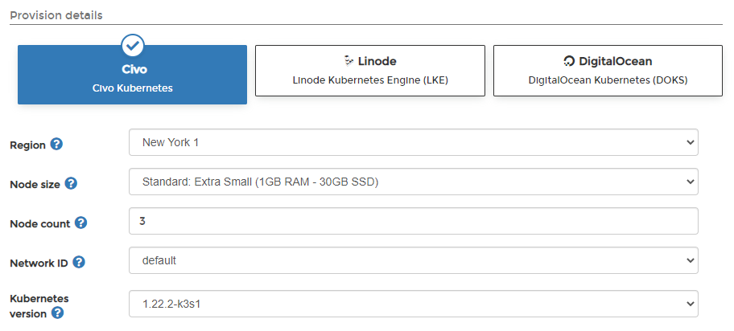
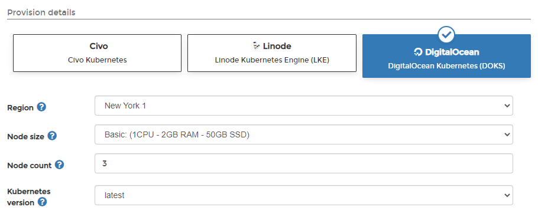

# Provision a new Kubernetes environment from Portainer

Portainer supports the provisioning of new Kubernetes environments on select cloud providers directly from within the interface, allowing you to spin up a new cloud Kubernetes environment and deploy the Portainer Agent with a few clicks.


This feature is only available in Portainer Business Edition.


We currently support the following cloud providers:

* [Civo](kaas.md#undefined)
* [Linode](kaas.md#linode)
* [DigitalOcean](kaas.md#digitalocean)

To get started, select **Environments** from the left hand menu then click **Add Environment**. Select the **KaaS** option.

## Civo

Select the **Civo** option from the list of providers, then set a **name** for your cluster. If you haven't already provided your Civo API token, paste it into the **API key** field and click **Save**.


You can retrieve your Civo API token by logging into the Civo dashboard, expanding the Settings menu and selecting Profile, then the Security tab.&#x20;


Select your cluster options from the fields below.

| Field/Option       | Overview                                                             |
| ------------------ | -------------------------------------------------------------------- |
| Region             | Select the region to deploy your cluster in.                         |
| Node size          | Select the size of the individual nodes in your cluster.             |
| Node count         | Enter the number of nodes to provision in your cluster.              |
| Network ID         | Select the network to add your cluster to.                           |
| Kubernetes version | Select the version of Kubernetes you want to deploy on your cluster. |

Once you have made your selections, click **Provision environment** to begin the provision. You will be returned to the Environments page which will display the status of the provision.

## Linode

Select the **Linode** option from the list of providers, then set a **name** for your cluster. If you haven't already provided your Linode API token, paste it into the **API key** field and click **Save**.


You can retrieve your Linode API token by logging into the Linode dashboard, clicking your account name in the top right and selecting API Tokens. Click Create a Personal Access Token, give it a label and set an expiry. The Portainer provisioning functionality only requires Read/Write for the Kubernetes option, so disable the rest.


Select your cluster options from the fields below.

| Field/Option       | Overview                                                             |
| ------------------ | -------------------------------------------------------------------- |
| Region             | Select the region to deploy your cluster in.                         |
| Node size          | Select the size of the individual nodes in your cluster.             |
| Node count         | Enter the number of nodes to provision in your cluster.              |
| Kubernetes version | Select the version of Kubernetes you want to deploy on your cluster. |

Once you have made your selections, click **Provision environment** to begin the provision. You will be returned to the Environments page which will display the status of the provision.

## DigitalOcean

Select the **DigitalOcean** option from the list of providers, then set a **name** for your cluster. If you haven't already provided your DigitalOcean API token, paste it into the **API key** field and click **Save**.


You can retrieve your DigitalOcean API token by logging into the DigitalOcean dashboard and selecting API at the bottom left. Click Generate New Token, enter a token name and an expiration time, and ensure that both Read and Write scopes are ticked.


Select your cluster options from the fields below.

| Field/Option       | Overview                                                             |
| ------------------ | -------------------------------------------------------------------- |
| Region             | Select the region to deploy your cluster in.                         |
| Node size          | Select the size of the individual nodes in your cluster.             |
| Node count         | Enter the number of nodes to provision in your cluster.              |
| Kubernetes version | Select the version of Kubernetes you want to deploy on your cluster. |

Once you have made your selections, click **Provision environment** to begin the provision. You will be returned to the Environments page which will display the status of the provision.

