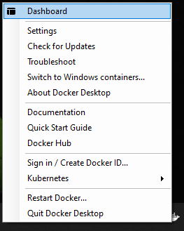
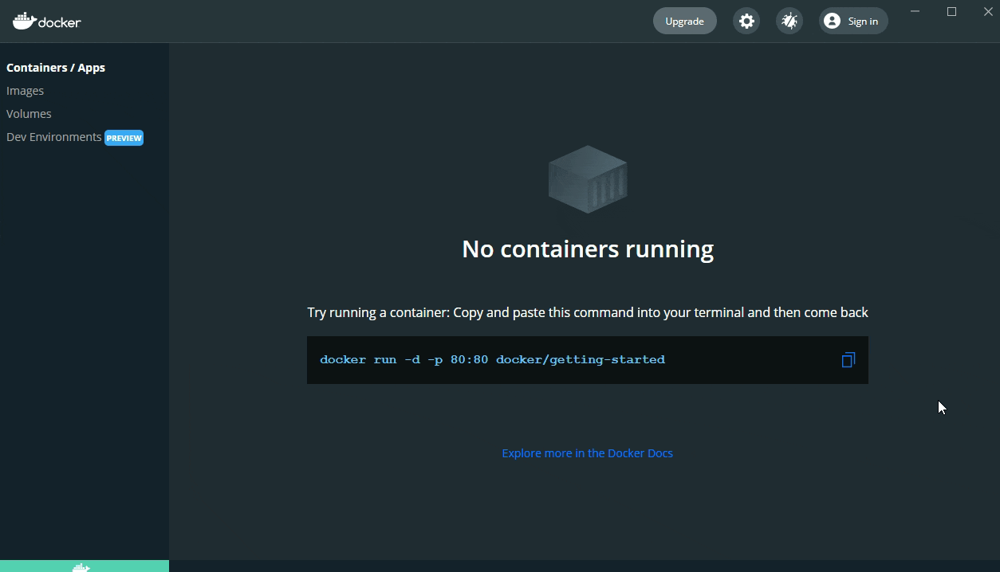

# Install Portainer Agent with Kubernetes on WSL / Docker Desktop

## Introduction

The following instructions will guide you in setting up Portainer Agent with Kubernetes running on Docker Desktop with WSL, and connecting it to your Portainer Server instance. If you do not have a working Portainer Server instance yet, please refer to the [Portainer Server installation guide](../../server/kubernetes/wsl.md) first.


This scenario is for testing purposes only.


## Preparation

Before you start, you must make sure that Kubernetes is enabled and running within your Docker Desktop installation. To enable Kubernetes in Docker Desktop, you need to open the dashboard of Docker Desktop. Right click the Docker icon in the system tray and click **Dashboard**:



Click **Settings**, then select **Kubernetes**, tick **Enable Kubernetes**, then click **Apply and Restart** (clicking **Install** in the dialog to install Kubernetes):



After a few minutes, you will see that Kubernetes is running in the bottom left status bar of Docker Desktop:


## Deployment

Based on how you would like expose the Portainer Agent, select an option below:



Using the following command, the Portainer Agent will be available on port `30778`.

```
kubectl apply -n portainer -f https://downloads.portainer.io/portainer-agent-k8s-nodeport.yaml
```



Using the following command, the Portainer Agent will be available at an assigned Load Balancer IP at port `9001`.

```
kubectl apply -n portainer -f https://downloads.portainer.io/portainer-agent-k8s-lb.yaml
```



## Adding your new environment

Once the agent has been installed you are ready to add the environment to your Portainer Server installation.&#x20;


For security, if an agent does _not_ have a custom `AGENT_SECRET` defined and has been running for longer than 72 hours _without_ being associated with a Portainer Server installation, the agent will stop accepting connections until it is restarted.



[kubernetes.md](../../../../admin/environments/add/kubernetes.md)

