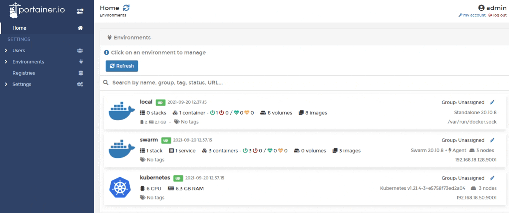
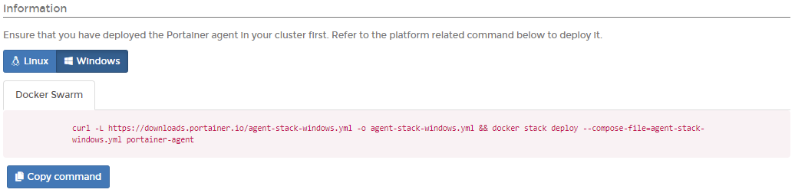
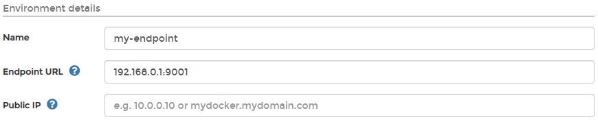
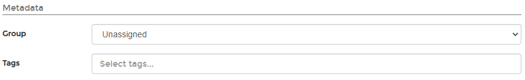

# Install Portainer Agent with Docker Swarm on WSL / Docker Desktop

## Introduction

Portainer uses the _Portainer Agent_ container to communicate with the _Portainer Server_ instance and provide access to the node's resources. This document will outline how to install the Portainer Agent on your node and how to connect to it from your Portainer Server instance. If you do not have a working Portainer Server instance yet, please refer to the [Portainer Server installation guide](../../server/swarm/wsl.md) first.

To get started, you will need:

* The latest version of Docker Desktop installed and working.
* Swarm mode enabled and working, including the overlay network for the swarm service communication.
* Administrator access on the manager node of your Swarm cluster.
* Windows Subsystem for Linux \(WSL\) installed and a Linux distribution selected. For a new installation we recommend WSL2.
* The manager and worker nodes must be able to communicate with each other over port `9001`. In addition, the Portainer Server installation must be able to reach the nodes on port `9001`. If this is not possible, we advise looking at the [Edge Agent](../edge.md) instead.

The installation instructions also make the following assumptions about your environment:

* You are accessing Docker via Unix sockets. Alternatively, you can also connect via TCP.
* SELinux is disabled within the Linux distribution used by WSL. If you require SELinux, you will need to pass the `--privileged` flag to Docker when deploying Portainer.
* Docker is running as root. Portainer with rootless Docker has some limitations, and requires additional configuration.
* If your nodes are using DNS records to communicate, that all records are resolvable across the cluster.

## Deploying the Agent

From the menu select **Environments** then click **Add environment**. Ensure **Agent** is selected in **Environment type**.



In the **Information** tab click the **Windows** button and select the **Docker Swarm** tab. Copy the command, then run the command on the manager node of your Docker Swarm cluster.


You must run the command on the Docker Swarm cluster before you proceed to entering the environment details.




The deployment command will return something similar to:

```text
Creating network portainer-agent_portainer_agent
Creating service portainer-agent_agent
```

To validate the Agent is running, you can run the following command:

```text
 docker service ls
```

the result of which should look something like this:

```text
ID                  NAME                    MODE                REPLICAS            IMAGE                    PORTS
tshb6ee2710s        portainer-agent_agent   global              1/1                 portainer/agent:latest
```

## Finishing the configuration

Once the Agent is running on the Docker Swarm cluster, enter the **environment details** using the table below as a guide:

| Field | Overview |
| :--- | :--- |
| Name | Give the environment a descriptive name. This is a required field. |
| Endpoint URL | Enter the IP or DNS name at which the Portainer Server instance can reach the environment along with the port \(`9001`\). This is a required field. |
| Public IP | URL or IP address where exposed containers will be reachable. This is an optional field and will default to the environment URL. This can be changed at a later date. |



In the **Metadata** section, as an optional step you can categorize the environment by adding it to a [group](../../../../admin/environments/groups.md) or  [tagging](../../../../admin/environments/tags.md) it for better searchability.



When everything is set, you can click **Add environment**.

