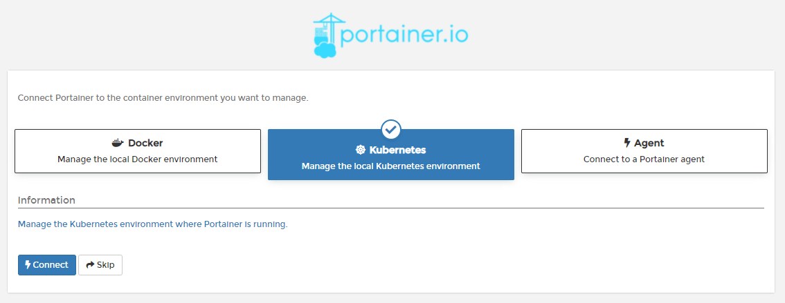
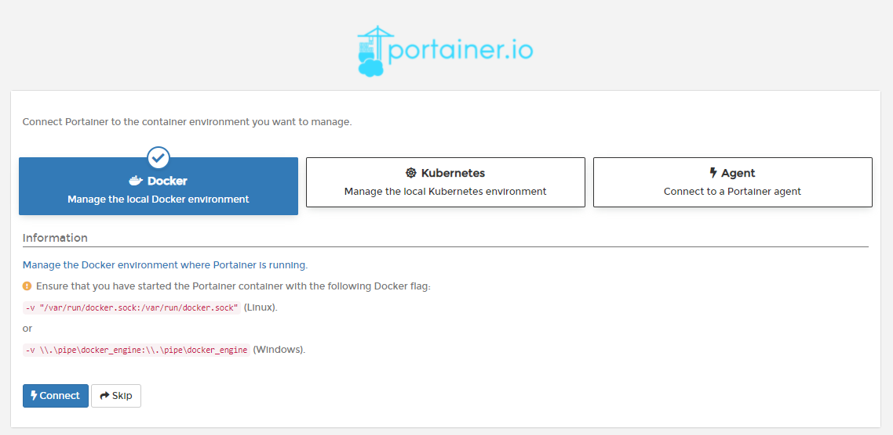

# Initial Setup


These instructions are for Portainer Community Edition. For Business Edition, please refer to the [Business Edition documentation](https://docs.portainer.io/v/be-2.7/).


## Create the initial administrator user

The first thing to do is create your first user, which will be an administrator. This password needs to be at least eight characters long. You can also change the username of the user if you prefer \(it defaults to `admin`\).

## Collection of statistics

We anonymously collect information about how Portainer is used via a tool called [Matomo](https://matomo.org/). You can disable this option, but we recommend leaving it activated. This will help us understand how our users use Portainer and improve it.

You can find more about what we do with your information in our [privacy policy](https://www.portainer.io/privacy-policy).

You can enable or disable connection statistics via the checkbox:

If you change your mind, this setting can be updated at a later date under [Settings](../../../admin/settings/) in the Portainer interface.

## Connect Portainer to the container environment

If you installed Portainer in Kubernetes you would choose Kubernetes, but if you installed in Docker, you may want choose manage the local Docker environment. Choose the option that makes sense for you. You will be able to [add additional endpoints](../../../admin/endpoints/add/) or [change existing endpoints](../../../admin/endpoints/) later through the Portainer interface.

Once you've selected the appropriate option, click **Connect**. If all goes well, you'll be logged into the Portainer interface.

## Next Steps

Congratulations, you've completed the Portainer setup! From here, your installation is ready to use.

If you need to add additional endpoints to your Portainer installation, you can find instructions for doing so under the Existing Installation guide.



