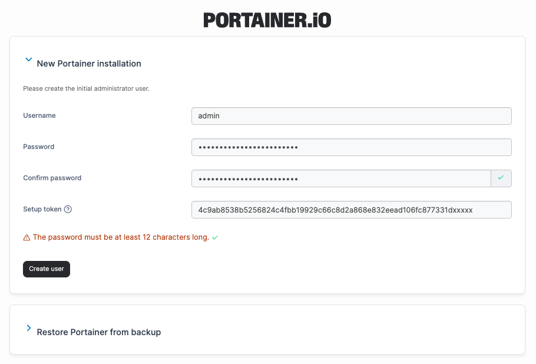
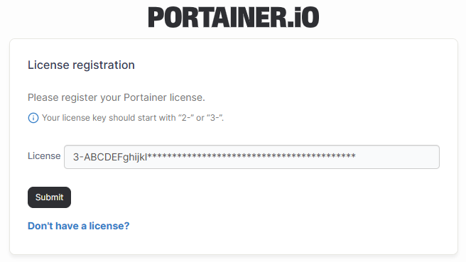
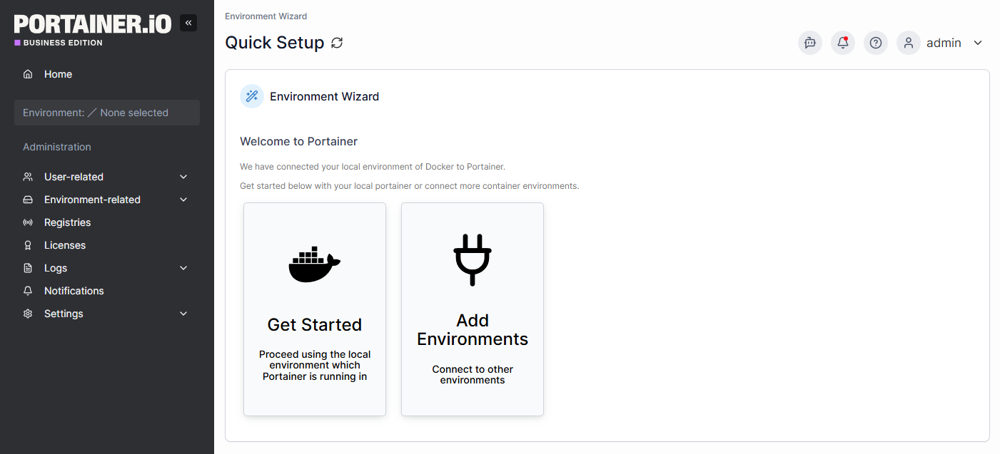

# Initial setup

Once the Portainer Server has been deployed, and you have navigated to the instance's URL, you are ready for the initial setup.

## Creating the first user

Your first user will be an administrator. The username defaults to `admin` but you can change it if you prefer. The password must be at least 12 characters long and meet the listed password requirements.

Your setup token can be found in your Portainer server logs - look for the `setup_token=` line. For help retrieving your token, or for details on starting Portainer without a setup token or with a custom one, refer to [this FAQ](../../../faqs/installing/setup-token.md).


Your Portainer server logs can be accessed with:

`docker logs <container>` , `podman logs <container>` , or `kubectl logs <pod_name>`


<figure><figcaption></figcaption></figure>

## Add your license key

You will now be asked to provide your license key. You will have been provided this when signing up for Business Edition or the free trial. If you don't have a license key, you can either click the **Don't have a license?** link or [get in touch with our team](mailto:success@portainer.io).

Paste the license key you were provided into the box and click **Submit**.

<figure><figcaption></figcaption></figure>

## Connecting Portainer to your environments

Once the admin user has been created, the **Environment Wizard** will automatically launch. The wizard will help get you started with Portainer.

<figure><figcaption></figcaption></figure>

The installation process automatically detects your local environment and sets it up for you. If you want to add additional environments to manage with this Portainer instance, click **Add Environments**. Otherwise, click **Get Started** to start using Portainer!
