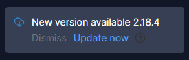
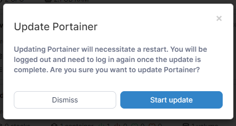

# Updating Portainer

Portainer releases contain new features and bug fixes so it's important to keep your installation up to date. We have [tested and validated](../requirements-and-prerequisites.md#valid-configurations) all Portainer version upgrades from 2.0.0 up to the latest release.

While it's possible that an untested unvalidated update path might work, we recommend that all update paths are tested and validated on a non-critical system before applying them to your production systems.


We added a [backup and restore feature](../../admin/settings/#backup-portainer) to Portainer BE 2.7 and strongly recommend that you take a backup of your Portainer instance before updating.



Starting with CE 2.9 and BE 2.10 Portainer is HTTPS enabled by default and uses port `9443` to serve the UI. HTTP can still be enabled on port `9000` if required.


## Update order

In general, we recommend updating your Portainer Server deployment _before_ you update the Portainer Agents. When we release new versions of Portainer we ensure that Portainer Server is able to talk to older versions of the Agent, and in most cases the reverse is true, but in some instances we make changes to the Agent that are not fully backward compatible with older versions of Portainer Server.

## Updating Portainer

### From within Portainer

From 2.19, Business Edition users are able to update their Portainer installation directly from within Portainer. To do so, click the **Update now** link in the update notification in the bottom left of the Portainer UI.

<figure><figcaption></figcaption></figure>

In the confirmation dialog, click **Start update** to proceed with the update.


Remember to [back up your Portainer installation](../../admin/settings/#backup-portainer) before updating!


<figure><figcaption></figcaption></figure>

### Manually update Portainer

If you would prefer to manually update your Portainer installation, choose your platform then follow the instructions:


[docker.md](docker.md)



[swarm.md](swarm.md)



[kubernetes.md](kubernetes.md)


### Update the Portainer Agent

If you are using the Portainer Edge Agent, we have specific update instructions for you:


[edge.md](edge.md)


### Upgrading to Business Edition

If you are coming from Portainer CE or the 1.24.x branch, we have guides for you as well.


[tobe](tobe/)

