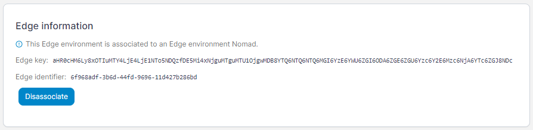
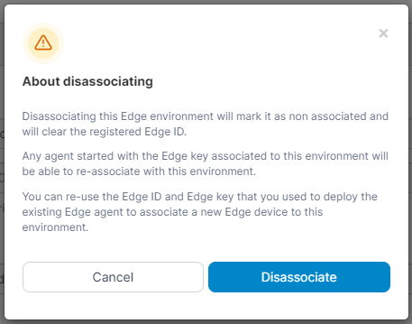
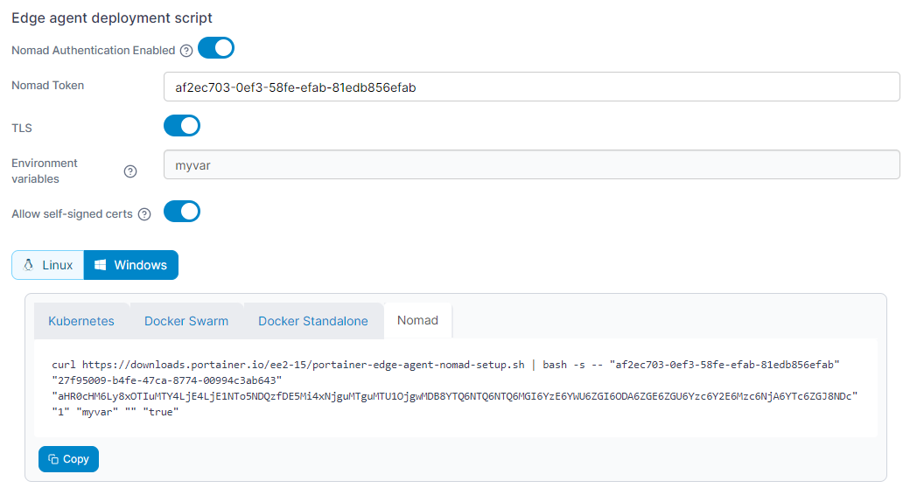

# Upgrading on Nomad

To upgrade the version of the Portainer Agent on a Nomad device, please use the following steps.


If you are using Nomad authentication, you will need to retrieve your Nomad token before proceeding.


In the Portainer UI, select **Environments** then select the Nomad environment you want to upgrade. Make note of the **Edge key** and **Edge identifier** as we will need these later.

<figure><figcaption></figcaption></figure>

Once you have the values recorded, click the **Disassociate** button, then click **Disassociate** in the warning that appears.

<figure><figcaption></figcaption></figure>

You will then be provided with a script generation dialog.&#x20;

Select **Nomad**, and if you are using authentication toggle the **Enable authentication** option and enter your **Nomad token**. Enter any other customizations you have for your environment such as environment variables.

<figure><figcaption></figcaption></figure>

Copy the generated command for environment installation, but don't run it yet. First, edit the copied command and replace the **Edge key** and **Edge identifier** values with those noted earlier.&#x20;

Finally, run the modified command on your Nomad device. The job will be deployed and updated, retaining your previous settings.
