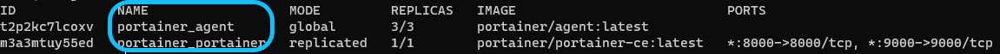

# Upgrading on Docker Swarm


Always match the agent version to the Portainer Server version. In other words, when you're installing or upgrading to Portainer 2.9.3 make sure all of the agents are also on version 2.9.3.



Before beginning any upgrade, we highly recommend [taking a backup](../../admin/settings/#backup-portainer) of your current Portainer configuration.


## Upgrading your Portainer Server


Starting from Portainer CE 2.9, HTTPS is enabled by default on port `9443.` These instructions will configure Portainer to use both 9443 for HTTPS and 9000 for HTTP. You can choose to [completely disable HTTP](../../admin/settings/#force-https-only) after the upgrade.&#x20;

Before you make Portainer HTTPS only, make sure you have all your Agents and Edge Agents already communicating with Portainer using HTTPS.&#x20;


To upgrade the Portainer Server and the agents on Docker Swarm, first run the following command on the manager node of your Docker Swarm cluster:

```
docker service ls 
```

Make note of the service names for Portainer. You will need them later.



To upgrade Portainer Server to the latest version, run the command below (replace the `portainer_portainer` service name if your setup differs):

```
docker service update --image cr.portainer.io/portainer/portainer-ce:2.9.3 --publish-add 9443:9443 --force portainer_portainer
```

To upgrade the Portainer Agent to the latest version, run the command below (replace the `portainer_agent` service name if your setup differs):

```
docker service update --image portainer/agent:2.9.2 --force portainer_agent 
```

```
docker service update --image cr.portainer.io/portainer/agent:2.9.3 --force portainer_agent 
```

This will deploy the newest version of Portainer and the agent across your swarm and upgrade the Portainer database to match.

When this is finished, go to `https://your-server-address:9443` or `http://your-server-address:9000` and log in. You should notice that the update notification has disappeared and the version number has been updated.
