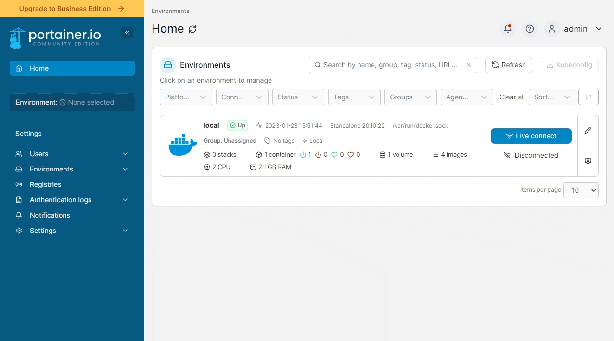
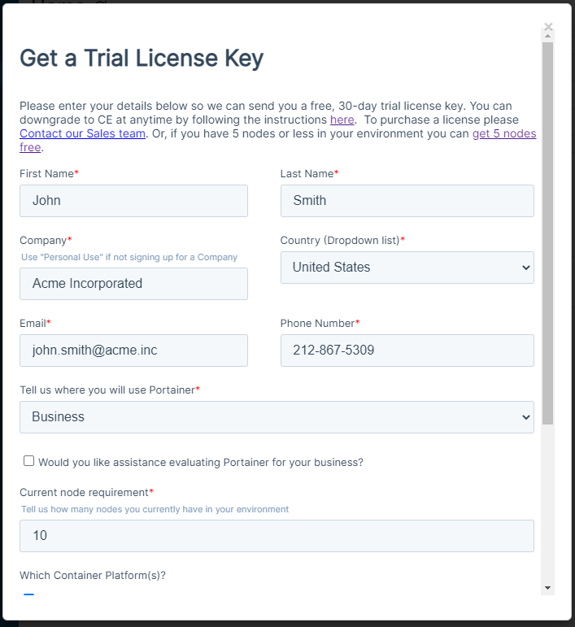
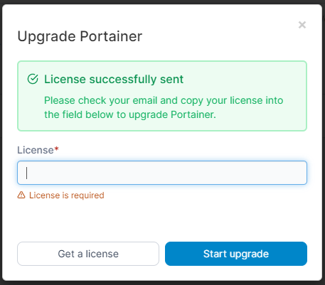

# Upgrade to Business Edition from within Portainer Community Edition

To upgrade from Portainer Community Edition to Portainer Business Edition from within Portainer, log in as an administrator and click the **Upgrade to Business Edition** message in the top left.

<figure><figcaption></figcaption></figure>

If you already have a license for Portainer Business Edition, paste it in the box and click **Start upgrade** to begin the upgrade process.

If you do not currently have a license, click **Get a license** and fill out the form to receive a trial key.

<figure><figcaption></figcaption></figure>

Your trial key will be sent to the email address you provided and you will be returned to the license entry form.


Your license should be sent automatically within a few minutes. If you have not received it please check your spam folders, or [get in touch with our team](mailto:success@portainer.io) if you have not received it in 24 hours.


<figure><figcaption></figcaption></figure>

When you receive your license, paste the key into the box and click **Start upgrade** to begin the upgrade process.

