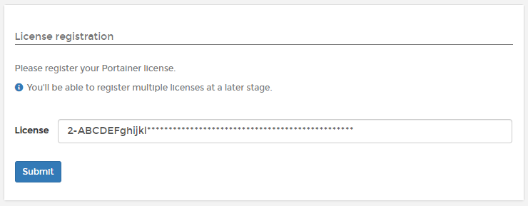

# Kubernetes


Select the Portainer CE to Portainer Business upgrade method below which matches the original installation method used.


## Method 1: Upgrade via Helm

To update your Helm repository, run this command first:

```
helm repo update
```

Run this command next to deploy the latest version of Portainer Business on your Kubernetes cluster with all of the settings used in your Helm deployment:

```
helm upgrade -n portainer portainer portainer/portainer --set enterpriseEdition.enabled=true
```

## Method 2: Upgrade via YAML Manifests

Choose the right YAML manifest based on your original deployment:



Use the following `kubectl` command to update a NodePort deployment:

```
kubectl apply -n portainer -f https://downloads.portainer.io/ee2-14/portainer.yaml
```



Use the following `kubectl` command to update a Load Balancer deployment:

```
kubectl apply -n portainer -f https://downloads.portainer.io/ee2-14/portainer-lb.yaml
```



This will deploy the newest version of Portainer Business on your Kubernetes cluster.

## Logging back in

When the upgrade is complete, log out of Portainer (if currently logged in) then log back in. When you log in for the first time, you'll be asked to enter your license key. Paste this in from the email we sent you.



'Business Edition' now appears in the bottom-left corner.
