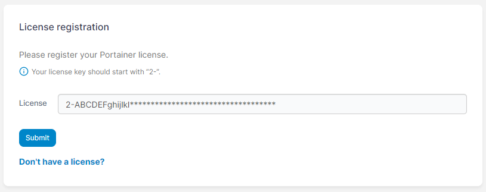

# Docker Swarm


This article assumes that you used our recommended deployment scripts.



Before you begin, copy the license key from the email we sent you.


To upgrade to Portainer Business Edition for Docker Swarm, use the following commands to deploy the newest version of Portainer Business on your Swarm Cluster:

```
docker service update --image portainer/portainer-ee:latest --force portainer_portainer
```

Log out of Portainer (if currently logged in) then log back in. When you log in for the first time, you'll be asked to enter your license key. Paste this in from the email we sent you.

<figure><figcaption></figcaption></figure>

'Business Edition' now appears in the bottom-left corner.
