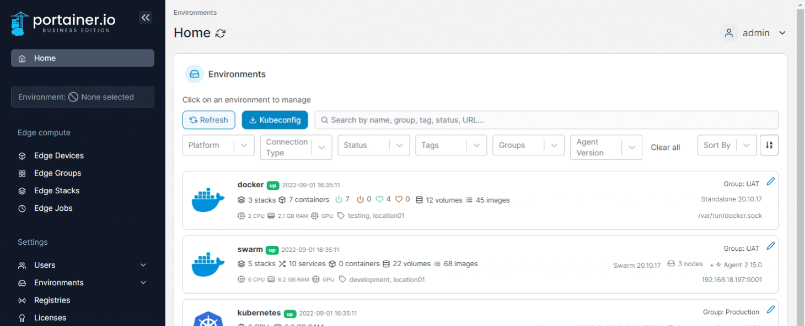

# Account settings

To get access to and update your user settings, click your username in the top-right of the Portainer UI and select **My account**.

<figure><figcaption></figcaption></figure>

## Changing your password

Enter the following details, using the table below as a guide. When you're finished, click **Update password**.

<figure><figcaption></figcaption></figure>

| Field/Option     | Overview                                                    |
| ---------------- | ----------------------------------------------------------- |
| Current password | Enter the password you currently use to log into Portainer. |
| New password     | Enter a new password for your account.                      |
| Confirm password | Enter the new password again.                               |

[Minimum password length requirements](../admin/settings/authentication/) are set by the administrator.

## Access tokens

This section allows you to manage your API access tokens. You can see a list of the access tokens that exist for your user as well as add and remove tokens as required.

<figure><figcaption></figcaption></figure>

For more information on access tokens, refer to our [API access documentation](../api/access.md#creating-an-access-token).

## Git credentials

This section lets you manage your saved Git credentials for use in deployments. These credentials are available only to your user.

<figure><figcaption></figcaption></figure>

To add a new credential, click the **Add git credential** button and fill out the fields using the table below as a guide:

| Field                 | Overview                                                                                                     |
| --------------------- | ------------------------------------------------------------------------------------------------------------ |
| Name                  | Enter a name for this credential entry. This is how it will appear when selecting it for use when deploying. |
| Username              | Enter the username, if relevant.                                                                             |
| Personal Access Token | Enter the personal access token.                                                                             |

<figure><figcaption></figcaption></figure>

Once you've entered the relevant details, click **Save git credential** to save the entry.

## Changing the theme

Portainer lets you choose between light, dark and high-contrast themes, or to auto-select the theme based on your system theme. The chosen theme applies only to this user.

Select a theme from the options. The change will be automatically applied.

<figure><figcaption></figcaption></figure>

