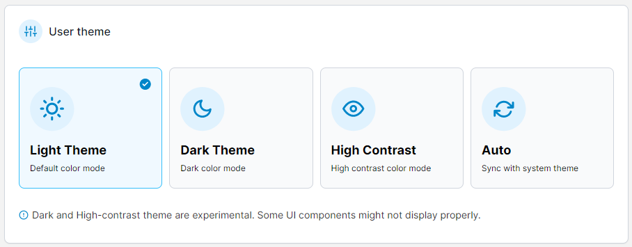
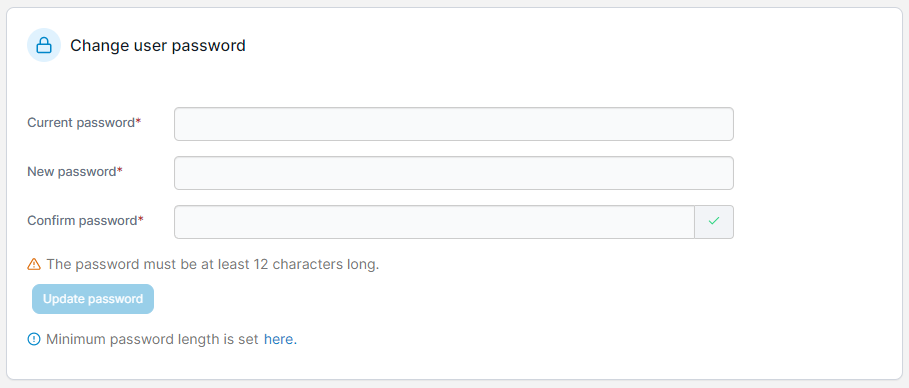
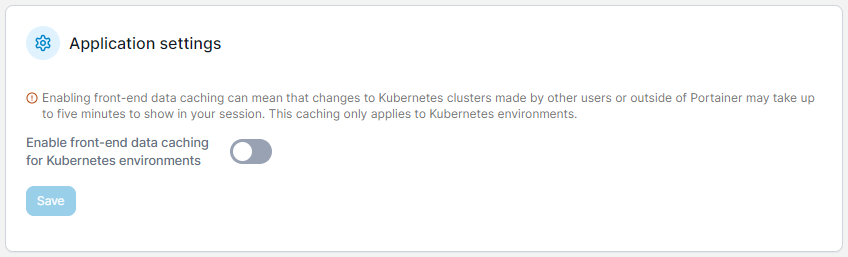
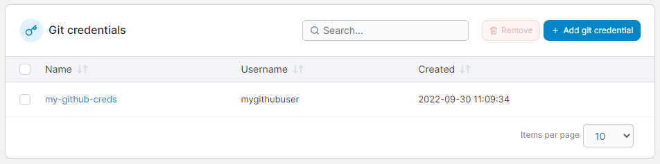
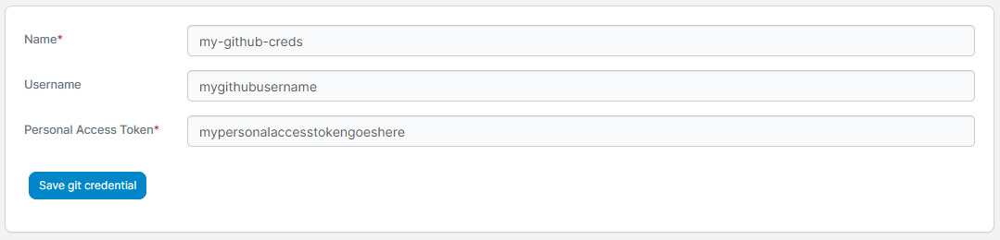
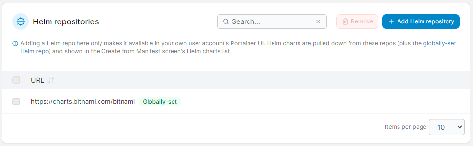

# Account settings

To get access to and update your user settings, click your username in the top-right of the Portainer UI and select **My account**.

<figure><figcaption></figcaption></figure>

## Changing the theme

Portainer lets you choose between light, dark and high-contrast themes, or to auto-select the theme based on your system theme. The chosen theme applies only to this user.

Select a theme from the options. The change will be automatically applied.

<figure><figcaption></figcaption></figure>

## Changing your password

Enter the following details, using the table below as a guide. When you're finished, click **Update password**.

<figure><figcaption></figcaption></figure>

| Field/Option     | Overview                                                    |
| ---------------- | ----------------------------------------------------------- |
| Current password | Enter the password you currently use to log into Portainer. |
| New password     | Enter a new password for your account.                      |
| Confirm password | Enter the new password again.                               |

[Minimum password length requirements](../admin/settings/authentication/) are set by the administrator.

## Application settings

In this section you can enable or disable front-end data caching for your Kubernetes environments. When this this option is enabled, Portainer will cache data provided about your Kubernetes cluster in the front-end in order to improve load times when viewing the cluster. This caching can however mean that you may not see fully up-to-date information, and changes made by other users or outside of Portainer may take up to five minutes to update in your session.

<figure><figcaption></figcaption></figure>

## Access tokens

This section allows you to manage your API access tokens. You can see a list of the access tokens that exist for your user as well as add and remove tokens as required.

<figure><figcaption></figcaption></figure>

For more information on access tokens, refer to our [API access documentation](../api/access.md#creating-an-access-token).

## Git credentials

This section lets you manage your saved Git credentials for use in deployments. These credentials are available only to your user.


This feature is only available in Portainer Business Edition.


<figure><figcaption></figcaption></figure>

To add a new credential, click the **Add git credential** button and fill out the fields using the table below as a guide:

| Field                 | Overview                                                                                                     |
| --------------------- | ------------------------------------------------------------------------------------------------------------ |
| Name                  | Enter a name for this credential entry. This is how it will appear when selecting it for use when deploying. |
| Username              | Enter the username, if relevant.                                                                             |
| Personal Access Token | Enter the personal access token.                                                                             |

<figure><figcaption></figcaption></figure>

Once you've entered the relevant details, click **Save git credential** to save the entry.

## Helm repositories

By default, Portainer ships with the [Bitnami Helm chart repository](https://bitnami.com/stacks/helm) already pre-configured. In this section you can add additional Helm repositories to reference when deploying Helm charts.

<figure><figcaption></figcaption></figure>

If you would like to add an additional third-party repo, click on **Add Helm repository**, enter the repository URL and click **Save Helm repository**.


Repositories added here are only available to your user. You can configure a Helm repository that will be available to all users in [Settings](../admin/settings/general.md#helm-repository).


<figure><figcaption></figcaption></figure>
