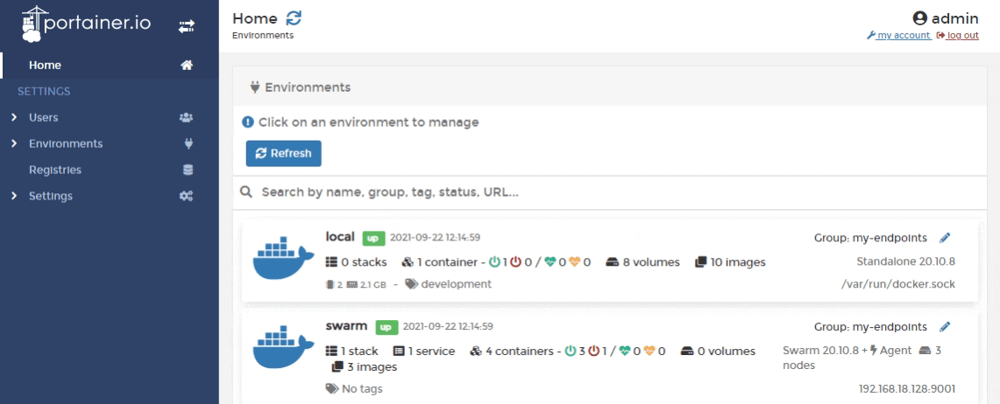
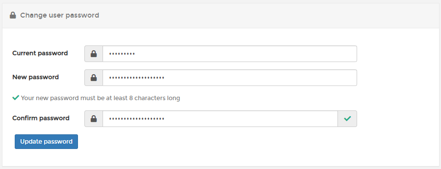
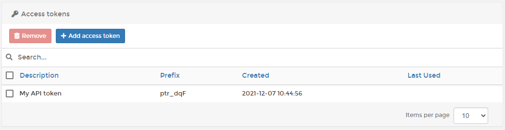
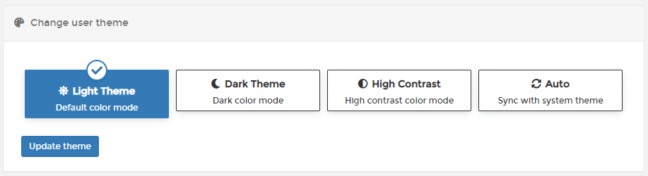

# Account settings

To get access to and update your user settings, select **my account** at the top-right of the Portainer UI.

## Changing your password

Enter the following details, using the table below as a guide. When you're finished, click **Update password**.

| Field/Option     | Overview                                                            |
| ---------------- | ------------------------------------------------------------------- |
| Current password | Enter the password you currently use to log into Portainer.         |
| New password     | Enter a new password for your account (at least 8 characters long). |
| Confirm password | Enter the new password again.                                       |

## Access tokens

This section allows you to manage your API access tokens. You can see a list of the access tokens that exist for your user as well as add and remove tokens as required.

For more information on access tokens, refer to our [API access documentation](../api/access.md).

## Changing the theme

Portainer lets you choose between light, dark and high-contrast themes. You can also choose to sync the Portainer theme to your system them. The chosen theme applies only to this user.


The Dark and High Contrast themes are experimental, and some UI components might not display properly when they are applied.


Select a theme from the options to preview how it looks. When you are happy with your chosen theme, click **Update theme** to save the changes.

