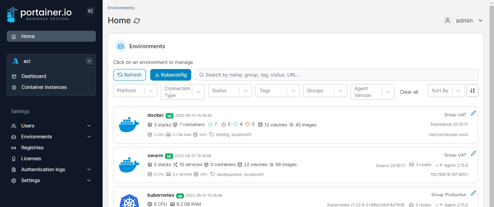
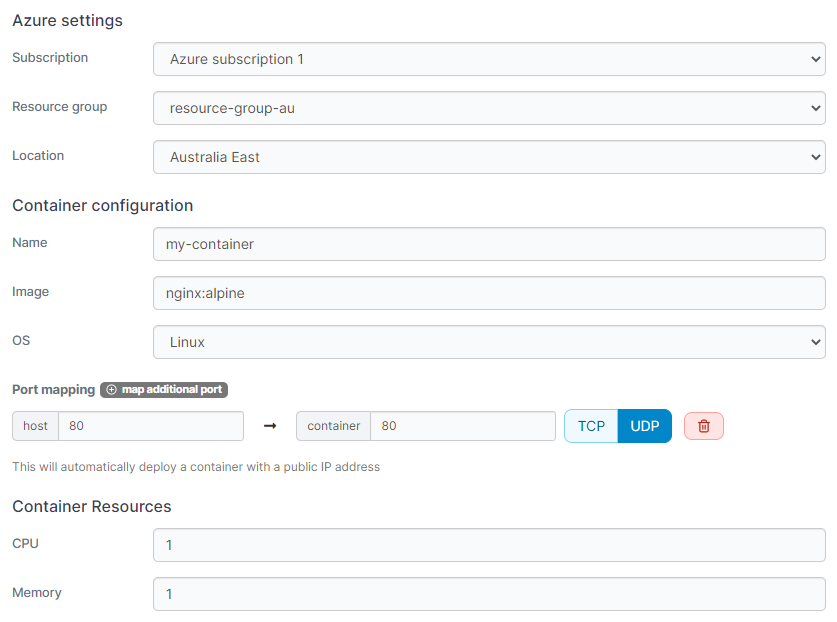

# Add a new container

From the menu select **Container instances** then click **Add container**.

<figure><figcaption></figcaption></figure>

Complete the configuration, using the table below as a guide:

| Field/Option   | Overview                                                                             |
| -------------- | ------------------------------------------------------------------------------------ |
| Subscription   | Select the subscription you want to use for the container.                           |
| Resource group | If two or more resource groups exist, select where you want to deploy the container. |
| Location       | Select which datacenter to run the container in.                                     |
| Name           | Give the container a descriptive name.                                               |
| Image          | Enter the name of the image that will be used to deploy the container.               |
| OS             | Select the OS (typically Linux or Windows).                                          |
| Port mapping   | Select the port needed to publish to the Internet.                                   |
| CPU            | Define how much CPU to allocate to the container.                                    |
| Memory         | Define how much memory to allocate to the container.                                 |

<figure><figcaption></figcaption></figure>

When you're ready, click **Deploy the container**. When the deployment has finished, you'll see it in the list of  Azure container instances.
