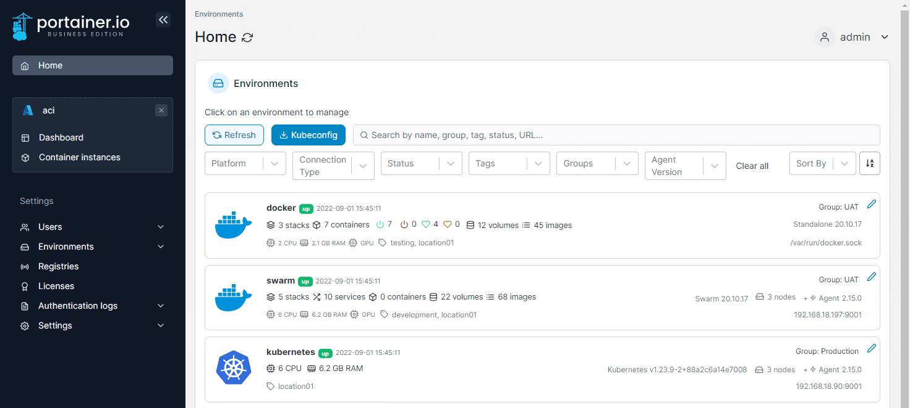
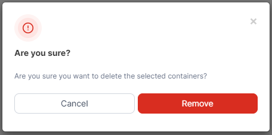

# Remove a container

From the menu select **Container instances**, tick the checkbox next to the container you want to remove then click **Remove**.

<figure><figcaption></figcaption></figure>

When the confirmation message appears, click **Remove**.

<figure><figcaption></figcaption></figure>
