---
metaLinks:
  alternates:
    - https://app.gitbook.com/s/Dalese9Lv4CX6YKS1s45/user/alerting
---

# Alerting


This section is only available in Portainer Business Edition and is accessible by administrator users only.


The Alerting page allows you to configure alerts for events related to your environments and for Portainer itself. Alerts will display on the Alerting page, and notifications can be sent via Slack, Microsoft Teams, email, or webhook.

To access, click **Alerting** under **Additional Functionality** in the left menu.

<figure>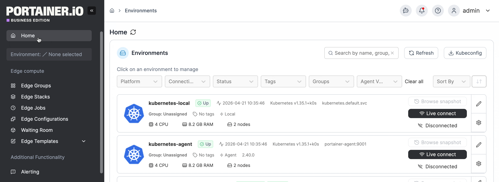<figcaption></figcaption></figure>

To set up an alert, first [configure the alert manager](./#settings) in the **Settings** tab, then [enable the alert rules you want to apply](./#rules) in the **Rules** tab.

## Active Alerts

This tab shows any active alerts with details including when the alert was first triggered. The **Actions** column contains a **Silence** button, allowing you to temporarily [silence an alert](./#silence-an-alert).

<figure><figcaption></figcaption></figure>

### Silence an alert

You can choose to temporarily silence an alert, for example when you are aware of an issue and are working to resolve it, but do not need ongoing notifications in the meantime. To silence an alert, click the **Silence** button in the **Actions** column and complete the form. Once ready, click **Create Silence**.

| Field/Option | Overview                                                                                                                                            |
| ------------ | --------------------------------------------------------------------------------------------------------------------------------------------------- |
| Comment      | Specify a comment to associate with the silencing action.                                                                                           |
| Created By   | The user that silenced the alert. By default this is set as your username.                                                                          |
| Duration     | Select the length of time to silence the alert, or choose **Custom** to set a custom length using the **Starts At** and **Ends At** date selectors. |
| Starts At    | The start date and time of the silencing. This is based on the **Duration** selection above if using a preset option.                               |
| Ends At      | The end date and time of the silencing. This is based on the **Duration** selection above if using a preset option.                                 |
| Matchers     | A list of the criteria this silencing action will match.                                                                                            |

<figure>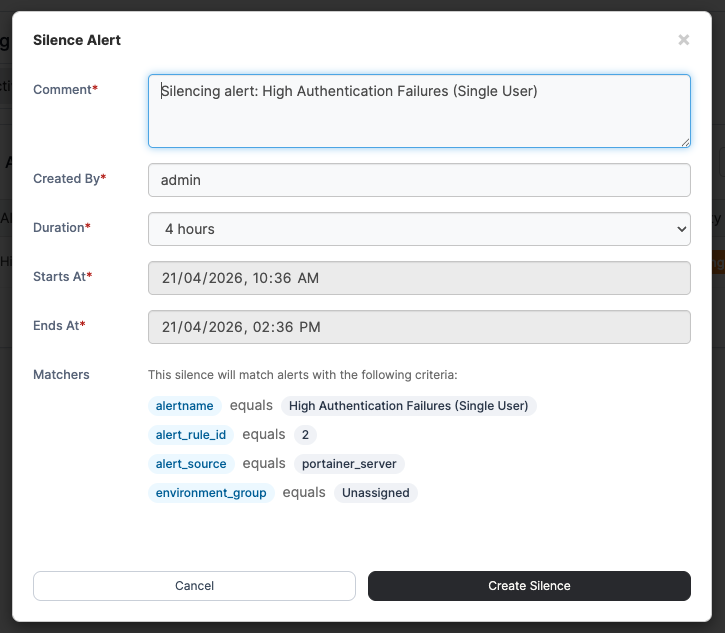<figcaption></figcaption></figure>

## Silenced Alerts

This tab lists any silenced alerts. Silenced alerts are active alerts that have been temporarily muted and will not send notifications. Each entry displays relevant details along with a trash icon in the **Actions** column - click this icon to remove the silence. Once removed, if the alert is still active, it will return to the **Active Alerts** table.

<figure>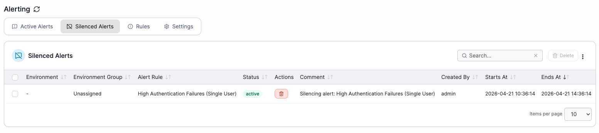<figcaption></figcaption></figure>

## Rules

The **Rules** tab is where you define the rules that trigger alerts. Rules are grouped into three categories:

* **Portainer** for instance-level concerns.
* **Security** for authentication and access.
* **Environment** for managed environment health and resource usage.

All rules are shown by default. You can filter by category by selecting one of the three options.

<figure>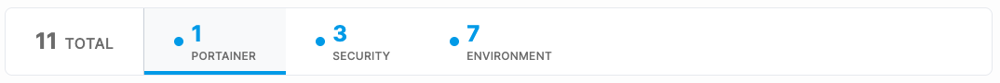<figcaption></figcaption></figure>

Each rule displays the conditions that will trigger an active alert. In the **Actions** column, use the toggle to enable a rule. [Some rules can be customized](./#editing-a-rule) by clicking the **Edit** button. Note that an [alert manager must be configured](./#settings) before a rule can be enabled.

For a full list of the available rules, see the [alerting rules](alerting-rules.md) page.&#x20;

<figure>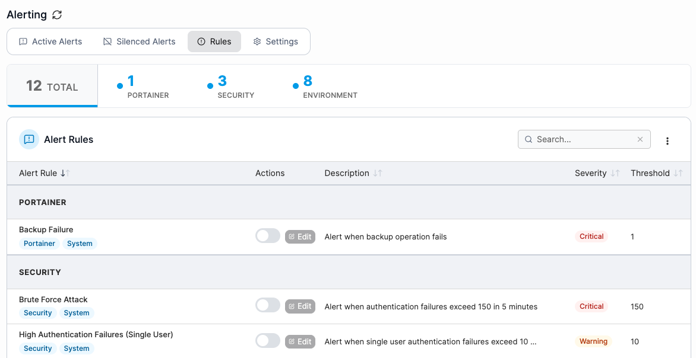<figcaption></figcaption></figure>

### Editing a rule

To edit a rule, click the **Edit** button in the **Actions** column for that rule.

From the rule view, the **Info** tab displays the rule's details.

<figure>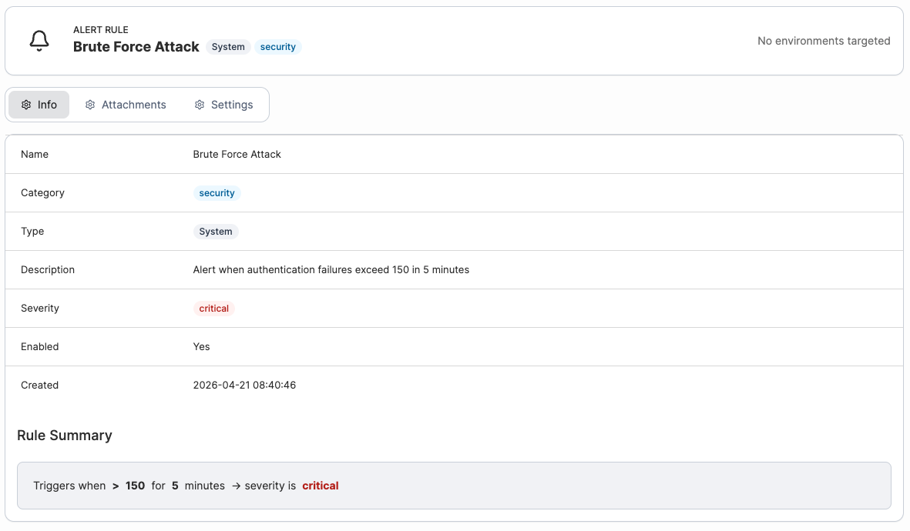<figcaption></figcaption></figure>

The **Attachments** tab shows which environment groups the rule applies to - by default, a rule applies to all relevant environments. To restrict a rule to specific environment groups, select the desired groups and click **Apply Changes**. This option is only available for rules that apply to environments.

<figure>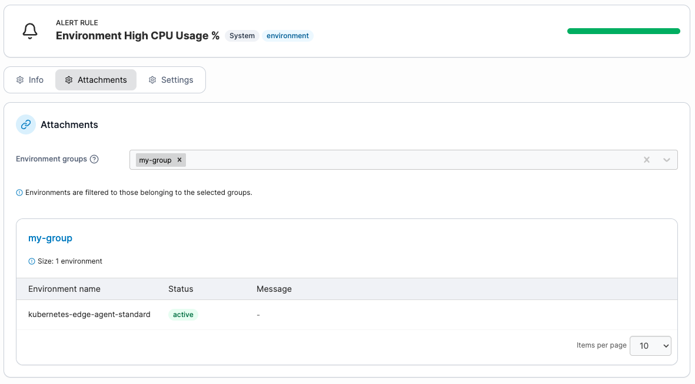<figcaption></figcaption></figure>

To modify the rule's configuration, navigate to the **Settings** tab and fill in the following details:

| Field/Option                    | Overview                                                                                                                                                                                                                                                                                                                                                                                                   |
| ------------------------------- | ---------------------------------------------------------------------------------------------------------------------------------------------------------------------------------------------------------------------------------------------------------------------------------------------------------------------------------------------------------------------------------------------------------- |
| Name                            | The name of the rule.                                                                                                                                                                                                                                                                                                                                                                                      |
| Description                     | The description of the rule.                                                                                                                                                                                                                                                                                                                                                                               |
| Threshold / Severity thresholds | 
The threshold at which the rule triggers. Depending on the rule, this may represent a number of consecutive failures, or a specific value being reached or exceeded.  For rules that support severity thresholds, separate Info, Warning, and Critical levels can be enabled, each with its own configured threshold. Note that threshold values must increase from Info to Warning to Critical.
 |
| Condition operator              | The comparison operator used in the condition trigger, for example equals or greater than.                                                                                                                                                                                                                                                                                                                 |
| Duration                        | The period within which the condition and threshold must be true for the rule to be triggered. For rules where this isn't relevant, a dash is listed.                                                                                                                                                                                                                                                      |
| Severity                        | The severity level of the rule.                                                                                                                                                                                                                                                                                                                                                                            |
| Enabled                         | When toggled on, the rule is enabled.                                                                                                                                                                                                                                                                                                                                                                      |

<figure>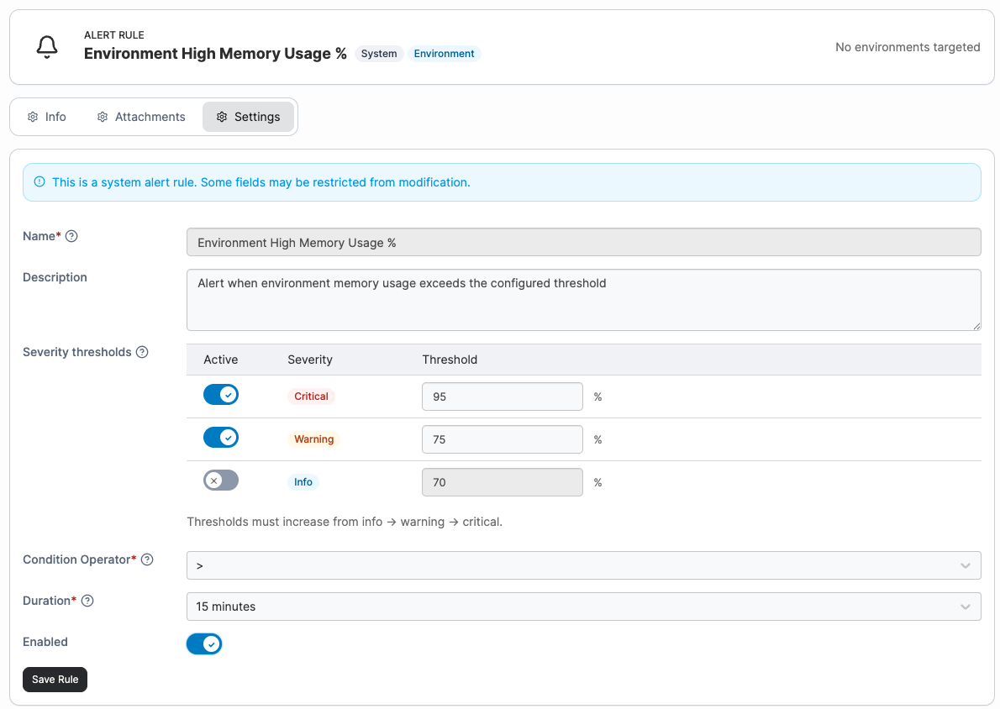<figcaption></figcaption></figure>

When you have made your changes, click **Save Rule**.

## Settings

The **Settings** tab lists the alert managers used for sending notifications and is where you configure them. For existing alert managers, details are displayed in the table with **Test** and **Edit** buttons in the **Actions** column.

* Click **Test** to check whether the alert manager instance is up and running. Note that this does not test the notification channel connections.
* Click **Edit** to modify the alert manager configuration, including adding notification channels.


At present only the `internal` instance is available.


<figure>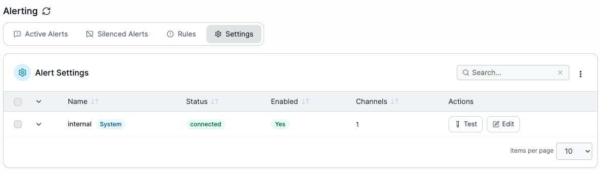<figcaption></figcaption></figure>

### Edit alert settings

To edit an alert manager instance, click the **Edit** button in the **Actions** column. Here you can view the instance name, enable or disable it using the toggle, and manage any notification channels.

<figure>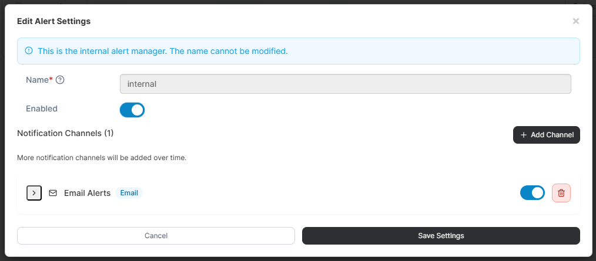<figcaption></figcaption></figure>

### Add a notification channel

To add a notification channel, go to the **Settings** tab, click **Edit** next to the instance, then click **Add Channel**. In the **New Channel** section, complete the required fields.

Select a **Notification Type** from the dropdown. The available options are:

* [Slack](./#slack)
* [Email](./#email)
* [Webhook](./#webhook)
* [Microsoft Teams V2](./#microsoft-teams-v2)

<figure>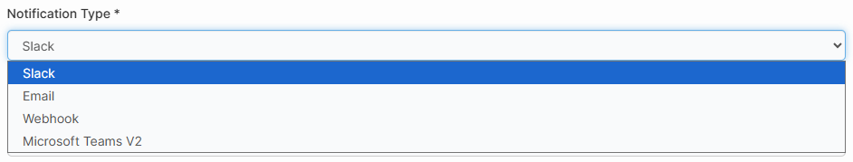<figcaption></figcaption></figure>

#### Slack

Complete the following fields when configuring a Slack notification channel:

| Field/Option | Overview                                                                                                                                                                     |
| ------------ | ---------------------------------------------------------------------------------------------------------------------------------------------------------------------------- |
| Name         | Specify a name for your notification channel.                                                                                                                                |
| Webhook URL  | Enter the webhook URL for your Slack integration. You can learn more about how to configure this [in the Slack API documentation](https://api.slack.com/messaging/webhooks). |

<figure>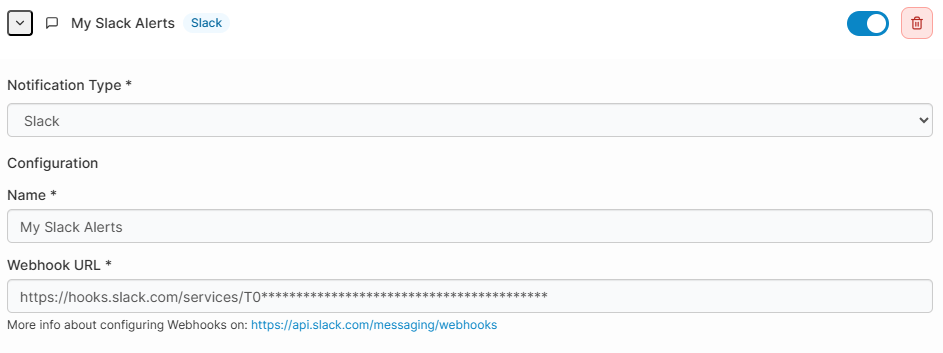<figcaption></figcaption></figure>

When you have completed the configuration, click **Save Settings**.

#### Email

Complete the following fields when configuring an email notification channel:

| Field/Option       | Overview                                                                                                |
| ------------------ | ------------------------------------------------------------------------------------------------------- |
| Name               | Specify a name for your notification channel.                                                           |
| SMTP Server        | Enter the URL and port for your SMTP server. If no port is provided, the default of `587` will be used. |
| SMTP Auth Username | Enter the username for authenticating with your SMTP server, if required.                               |
| SMTP Auth Password | Enter the password for authenticating with your SMTP server, if required.                               |
| Require TLS        | If your SMTP server requires TLS, toggle this option on.                                                |
| To Email Address   | Enter the email address you want to send notifications to.                                              |
| From Email Address | Enter the email address that will appear as the sender for your notification emails.                    |

<figure>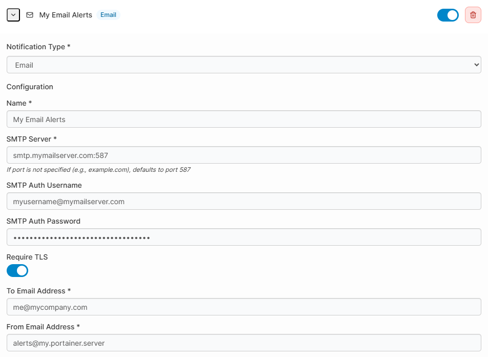<figcaption></figcaption></figure>

When you have completed the configuration, click **Save Settings**.

#### Webhook

Complete the following fields when configuring a webhook notification channel:

| Field/Option | Overview                                      |
| ------------ | --------------------------------------------- |
| Name         | Specify a name for your notification channel. |
| Webhook URL  | Enter the URL for your webhook.               |

<figure>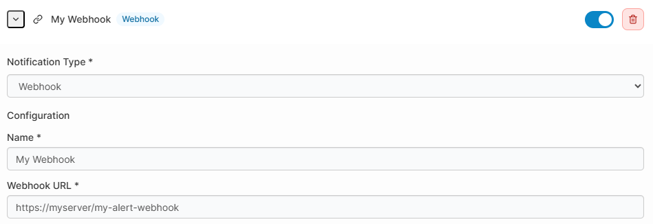<figcaption></figcaption></figure>

When you have completed the configuration, click **Save Settings**.

#### Microsoft Teams V2

Complete the following fields when configuring a Microsoft Teams V2 notification channel:

| Field/Option | Overview                                                                                                                                                                                                                                                                  |
| ------------ | ------------------------------------------------------------------------------------------------------------------------------------------------------------------------------------------------------------------------------------------------------------------------- |
| Name         | Specify a name for your notification channel.                                                                                                                                                                                                                             |
| Webhook URL  | Enter the webhook URL for your Microsoft Teams integration. You can learn more about configuring Microsoft Teams webhooks [in the Microsoft documentation](https://docs.microsoft.com/en-us/microsoftteams/platform/webhooks-and-connectors/how-to/add-incoming-webhook). |

<figure>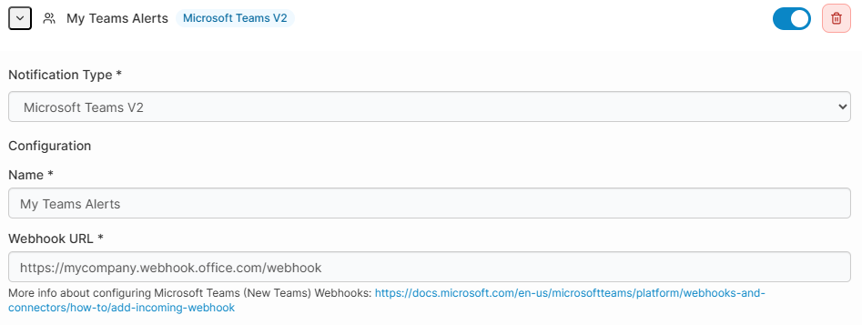<figcaption></figcaption></figure>

When you have completed the configuration, click **Save Settings**.
