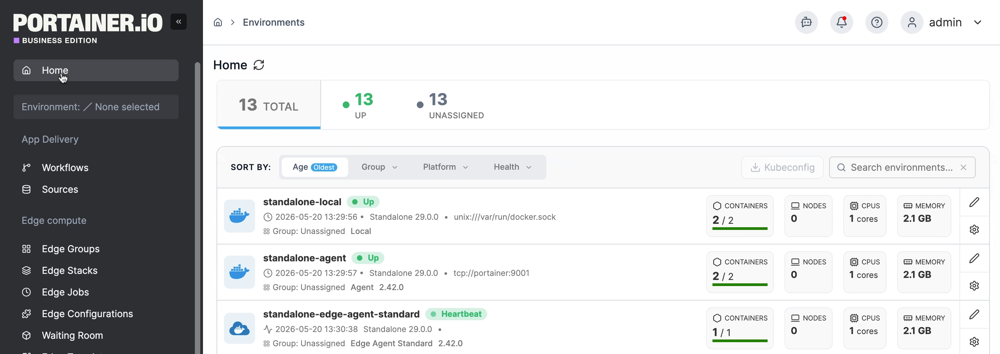
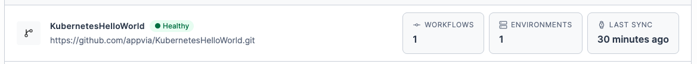
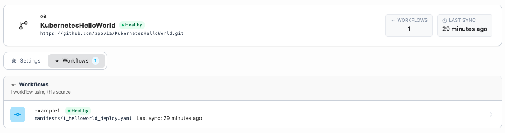
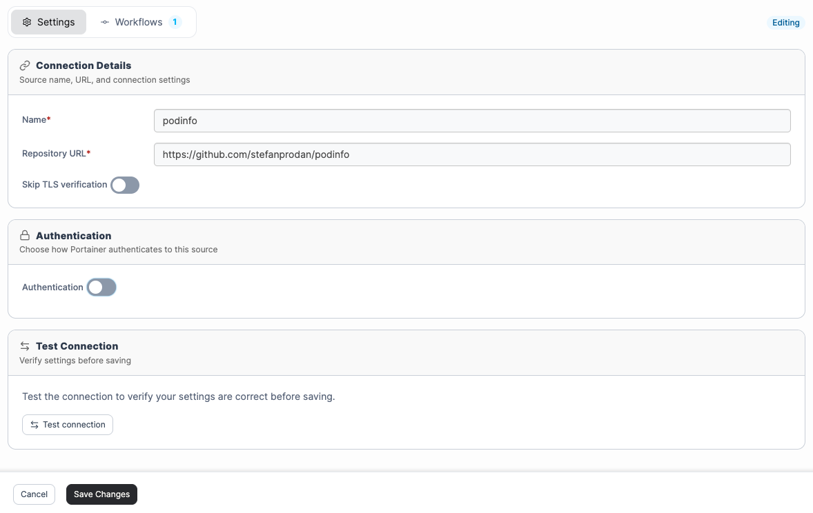

# Sources

The GitOps Sources screen provides a central place to view and manage all external sources connected to your Portainer instance, including Git repositories, registries, and GitOps-created authentication tokens.&#x20;


Supporting resources such as Service Accounts, ConfigMaps, and Secrets deployed via Create from code are not included in the Sources view.


To view your GitOps sources, select **Sources** from the left-hand menu.

<figure><figcaption></figcaption></figure>

From this view, you can monitor the connectivity status of each source, manage credentials, and maintain consistency across the platform, without needing to navigate between multiple configuration screens.

Each source displays its current connectivity status, calculated at the time of the last connection attempt, whether triggered manually or via an automated GitOps polling workflow. If a credential expires or a network change blocks access, the status updates to reflect this. It also displays the source URL, the number of workflows and environments the source is connected to, and the time of the last sync.&#x20;

<figure><figcaption></figcaption></figure>

### View a source

Click a source to view its details.

From this view, you can select **Test Connection** to verify that the source is reachable. You can also **Remove** the source if it is no longer used by any GitOps Workflows.

The **Settings** tab shows:

* The **Connection Details**, including the repository URL, branch, and source type.
* The **Authentication** method configured for the source.
* Any **Change Detection** settings.
* The **Sync Status**, including the time of the last sync.

<figure><figcaption></figcaption></figure>

The **Workflows** tab lists any [workflows](workflows.md) using this source.

<figure><figcaption></figcaption></figure>

### Edit a source&#x20;

To edit a source, select **Edit** in the top right corner of the **Settings** view. In edit mode, update the connection details or authentication settings as needed, then optionally select **Test Connection** to verify your changes before saving. Select **Save Changes** when done.

<figure><figcaption></figcaption></figure>
