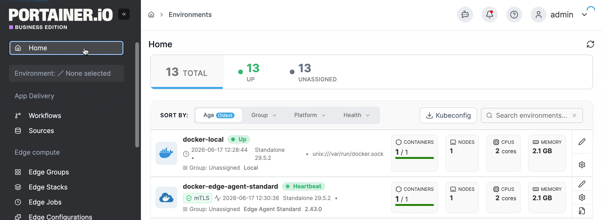
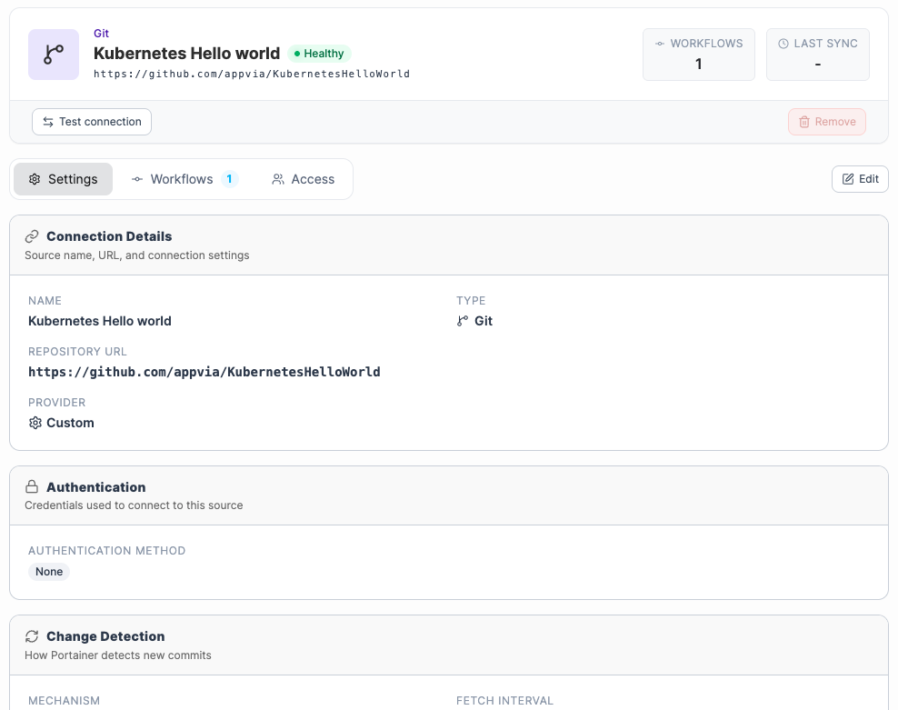
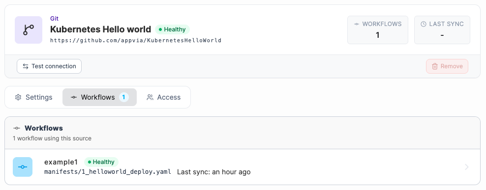
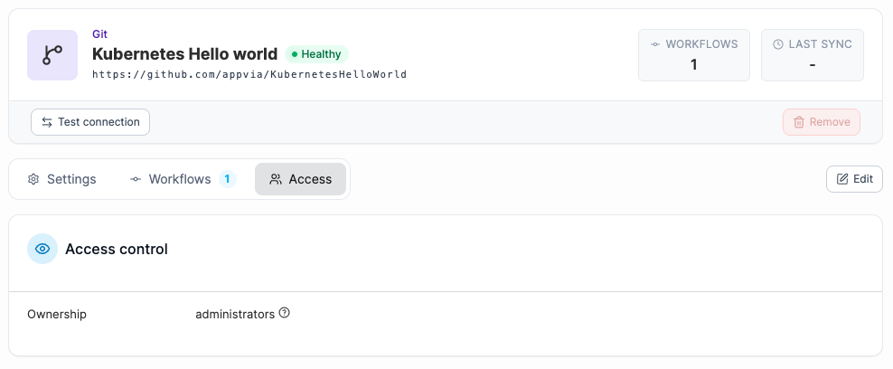
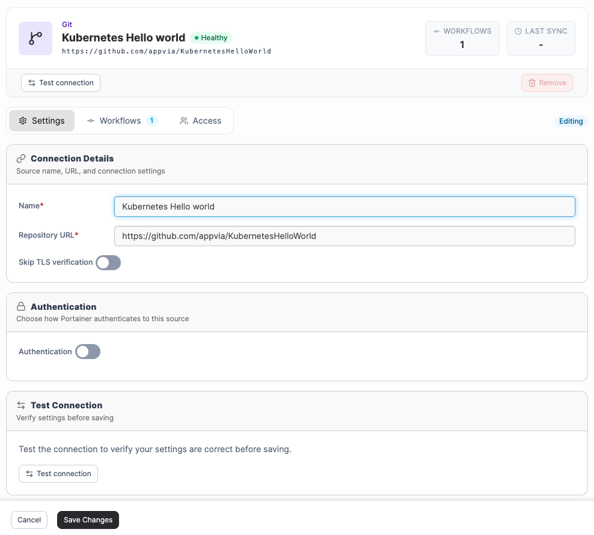

# Sources

The GitOps Sources screen provides a central place to create, view and manage external sources connected to your Portainer instance, including Git repositories, registries, and GitOps-created authentication tokens.&#x20;


Supporting resources such as Service Accounts, ConfigMaps, and Secrets deployed via Create from code are not included in the Sources view.


To view your GitOps sources, select **Sources** from the left-hand menu.

<figure><figcaption></figcaption></figure>

From this view, admin users can [add a new source](add-a-new-source/), monitor the connectivity status of each source, and manage credentials - maintaining consistency across the platform without navigating between multiple configuration screens.&#x20;

Each source displays its current connectivity status, calculated at the time of the last connection attempt, whether triggered manually or via an automated GitOps polling workflow. If a credential expires or a network change blocks access, the status updates to reflect this. It also displays the source URL, the number of workflows and environments the source is connected to, and the time of the last sync.&#x20;

<figure><figcaption></figcaption></figure>

### View a source

Click a source to view its details.

From this view, you can select **Test Connection** to verify that the source is reachable. If you have edit rights for the source, can also **Remove** the source if it is no longer used by any GitOps Workflows.

The **Settings** tab shows:

* The **Connection Details**, including the repository URL, branch, and source type.
* The **Authentication** method configured for the source.
* Any **Change Detection** settings.
* The **Sync Status**, including the time of the last sync.

<figure><figcaption></figcaption></figure>

The **Workflows** tab lists any [workflows](../workflows.md) using this source.

<figure><figcaption></figcaption></figure>

The **Access** tab displays the access level that is in place for this source. The access level defines who can use and edit the source.&#x20;

<figure><figcaption></figcaption></figure>

### Edit a source&#x20;

To edit a source, select **Edit** in the top-right corner of the **Settings** or **Access** view. Note that only users with edit access to the source can open it in edit mode. In edit mode, you can update connection details and authentication settings from the **Settings** tab, optionally select **Test Connection** to verify your changes before saving. To update access settings, make your selection from the **Access** tab - only admin users can modify access settings. Select **Save Changes** when done.

<figure><figcaption></figcaption></figure>
