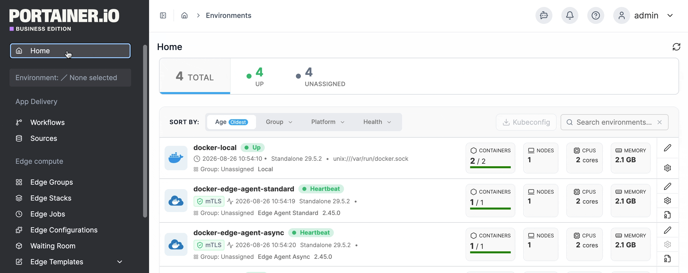
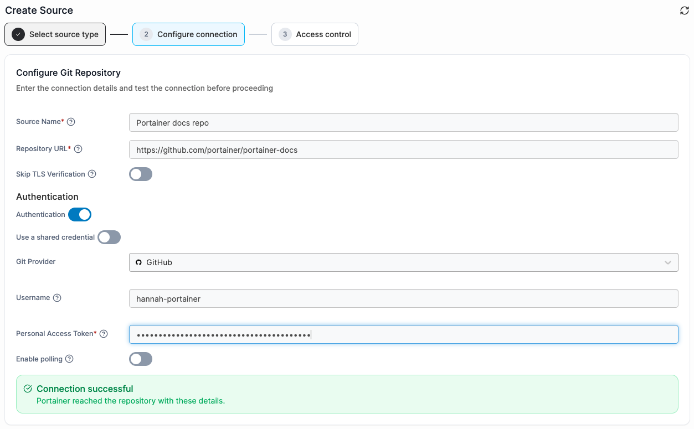
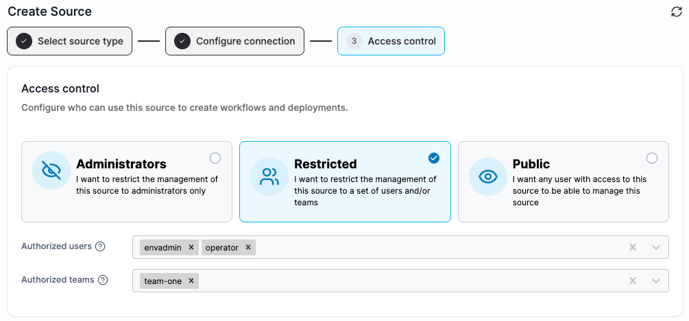

# Add a new Git Repository source


Portainer's Git deployment functionality does not currently support the use of Git submodules. If your repository includes submodules, they will not be pulled as part of the deployment. We [hope to add support](https://github.com/orgs/portainer/discussions/9767) for submodules in a future release.



Symlinks within a Git repository are not supported. Repositories containing symlinks will not be deployed successfully.


To add a new source from a Git Repository (GitHub, GitLab, Bitbucket, etc.), select **Sources** in the left hand menu, select **Add new** at the top right of the page, then fill in the form using the details below as a guide.&#x20;

<figure><figcaption></figcaption></figure>

As you enter your details, your connection will be checked and reported at the bottom of the form.&#x20;

|                                  |                                                                                                                                                                                                                                                                                                                  |
| -------------------------------- | ---------------------------------------------------------------------------------------------------------------------------------------------------------------------------------------------------------------------------------------------------------------------------------------------------------------- |
| Source Name                      | Give your source a descriptive name.                                                                                                                                                                                                                                                                             |
| Repository URL                   | Enter the URL to your Git repository.                                                                                                                                                                                                                                                                            |
| Skip TLS Verification            | Enable this option to skip verification of your Git repository's TLS certificate.                                                                                                                                                                                                                                |
| Authentication                   | Enable this if your Git repository requires authentication.                                                                                                                                                                                                                                                      |
| Use a shared credential          | Enable this to use an existing [shared credential](../../../admin/settings/credentials/) instead of providing authentication details.                                                                                                                                                                            |
| Git provider                     | Select your Git provider from the drop down menu, the authentication details will change based on your selection.                                                                                                                                                                                                |
| Authorization type               | When providing details for a **Custom** Git Provider, select if you would like to authorize with a password (Basic), or an Access Token (Token).                                                                                                                                                                 |
| Username                         | Enter your the username for your Git provider account.                                                                                                                                                                                                                                                           |
| Personal Access Token / Password | When Authentication is enabled, enter your personal access token or password. Ensure your token has repository read permissions, see the [Git authentication token permissions FAQ](https://docs.portainer.io/faqs/getting-started/what-scopes-are-required-for-github-gitlab-and-bitbucket-tokens) for details. |
| Enable polling                   | When enabled, Portainer periodically fetches this repository to detect changes.                                                                                                                                                                                                                                  |
| Fetch interval                   | When **enable polling** is selected, specify how frequently polling occurs using syntax such as, 5m = 5 minutes, 24h = 24 hours, 6h40m = 6 hours and 40 minutes.                                                                                                                                                 |

<figure><figcaption></figcaption></figure>

Select **Continue** when you have completed your details and have a successful connection.&#x20;

Finally, configure who can use the source or edit the source's connection details. Choose one of the following access levels:

* **Administrators:** Only admin users can edit and use the source.
* **Restricted:** Specify any **Authorized users** and **Authorized teams** permitted to edit and use the source. Only these users and teams - plus admins - will have access.
* **Public:** Any user with access to this environment can edit and use the source.

<figure><figcaption></figcaption></figure>

Select **Create** to save your source.
