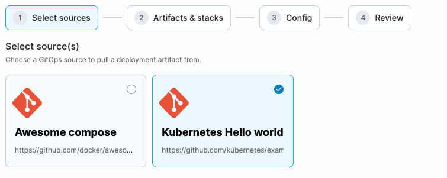
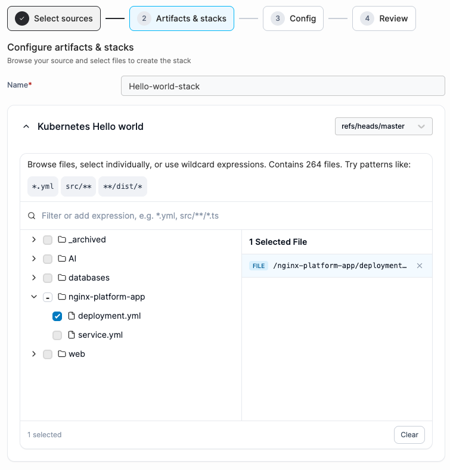
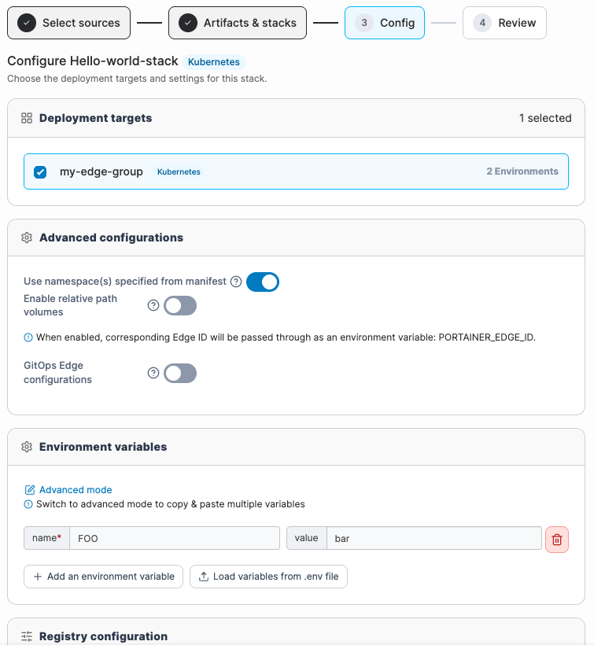
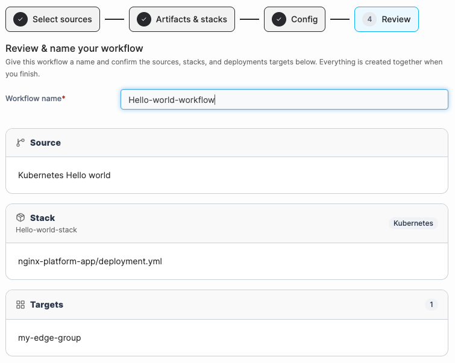

# Add a new workflow


Creating a workflow assumes you have:

* At least one [source](../sources/add-a-new-source/)
* At least one [edge group](../../edge/groups.md)


To create a new workflow, in the left-hand menu select **Workflows**, then select **Add new** at the top right of the page.&#x20;

<figure><figcaption></figcaption></figure>



### Select a source

Choose a GitOps [source](../sources/) to pull a deployment artifact from, then press **Continue**.&#x20;

<figure><figcaption></figcaption></figure>



### Create a stack

Browse your source and select the file that defines this stack.

Give the stack a name, then browse the source's file structure to select the file you want to use. You can either navigate the file tree directly, or search for a file using a wildcard expression and select **Add expression**. Select **Clear** in the bottom right of the file selector to clear your current selection, or select **Continue** once you've finished selecting files.

<figure><figcaption></figcaption></figure>



### Configure the workflow



#### Select a deployment target

Select one or more [edge groups](../../edge/groups.md) to deploy this stack to. Each group shows its platform badge (Docker or Kubernetes) and the number of environments it contains. Only groups that match the detected deployment type from the previous step are listed.



#### Select your advanced configurations

**Use namespace(s) from manifest:** \
When on, Portainer enforces the namespace(s) declared in the manifest file itself, rather than letting the deployment use or be overridden by a default namespace. Only visible when the selected file was detected as a Kubernetes deployment.

**Enable relative path volumes:**\
Allows the deployment file to reference paths relative to the repository root as bind-mount volumes. When enabled, Portainer clones the repository to the specified filesystem path on the edge device before deploying, making those relative paths valid on the host.

**Local filesystem path:**\
The absolute path on the edge device where Portainer clones the repository content. Example: `/mnt/portainer/repos`.

**Always clone git repository:**\
When on, Portainer always performs a full clone of the repository on every deploy cycle, rather than reusing a previously cloned copy. Ensures the edge device always has the exact current state of the repository but increases deploy time and bandwidth.

**GitOps edge configurations:**\
Enables per-device configuration using folder or file names that match the Portainer Edge ID of each device. When a deploy runs, Portainer looks for a folder or file in the repository whose name matches the device's Edge ID and applies it as the configuration for that device. The Edge ID is also injected as an environment variable: `PORTAINER_EDGE_ID`.

This makes it possible to ship a single workflow that deploys different configuration to different edge devices from one repository.


Files named `${PORTAINER_EDGE_ID}.env` or `${PORTAINER_EDGE_GROUP}.env` inside the config folder are automatically loaded for Compose variable interpolation.




#### Add any environment variables

Optionally, add environment variables using one of the following methods:

* Select **Add an environment variable** to add variables individually.
* Select **Load variables from .env file** to import them from a file.
* Switch to advanced mode and paste `key=value` pairs directly into the text box.



#### Specify any registry settings

**Pre-pull images:**\
Pulls the image before deployment starts, useful when image downloads may be slow or unreliable and could otherwise cause the deployment to fail.

**Retry deployment:**\
Lets the edge agent retry deployment if it fails initially. If enabled, choose a retry window: 10 minutes, 1 hour, 1 day, 1 week, or 1 year.

**Use credentials**:\
Lets you provide credentials for a private registry that requires authentication. If enabled, select the registry to use.



#### Select your updates configuration

The **Update strategy** controls how the deployment is rolled out across edge devices when a new version is pushed:

* **All at once:** deploys to all targeted devices simultaneously. Fastest but carries the highest risk if the new version has issues.
* **Parallel edge device(s):** deploys to a subset of devices at a time, waiting between batches. Limits blast radius if something goes wrong mid-rollout.

**Parallel device count:**\
How many edge devices receive the update in each batch. Two sub-options:

* **Fixed:** the same number of devices per batch throughout the rollout.
* **Incremental:** the batch size grows with each round (e.g. 1 → 2 → 4…), useful for a canary-style progressive rollout.

**Timeout:**\
How long Portainer waits for a batch to complete before treating it as failed and applying the failure action.

**Update delay:**\
Waiting period between batches. Gives services time to stabilise before the next group of devices is updated.

**On failure:**\
What Portainer does when a batch fails or times out:

* **Continue:** proceed to the next batch regardless. Use when a partial rollout is acceptable.
* **Pause:** stop the rollout and wait for manual intervention. Failed devices stay on their current version.
* **Rollback:** automatically revert failed devices to the previous working version.



Select **Continue** when you've finished configuring your workflow.&#x20;

<figure><figcaption></figcaption></figure>



### Name and review your workflow

Name the workflow and confirm everything before it's created.&#x20;

<figure><figcaption></figcaption></figure>



Select **Create** once you're happy with the configuration. Portainer creates the workflow, the stack, and begins deploying to the selected edge groups. All resources are created together in one operation. The new workflow will appear in the Workflows table.
