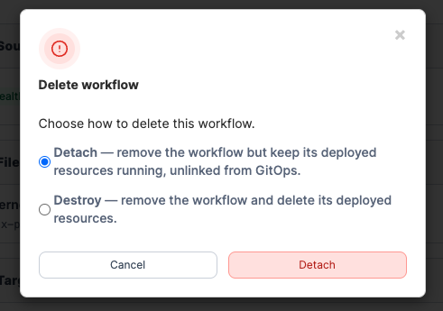

# Manage a workflow


Managing a workflow is read-only for Community Edition.&#x20;


The workflow detail page gives you a live view of a workflow's health, the git sources and files it draws from, the stacks it manages, and the environments those stacks are deployed to.

To manage a GitOps workflow, in the left-hand menu select **Workflows**, then click into the workflow you would like to manage.&#x20;

### Edit a workflow

To edit a workflow, from the workflow details view, select **Edit**. This returns you to the [workflow creation](add-a-new-workflow.md) steps with your preconfigured values, allowing changes to any field.

### Delete a workflow

To delete a workflow, from the workflow details view, click **Delete.** You will then be asked to choose what happens to the stacks and resources it has already deployed. Choose between the following:

**Detach (default):** \
Removes the workflow record from Portainer but leaves all deployed stacks and resources running exactly as they are, no longer linked to any GitOps workflow. Choose this when you want to take manual control of the resources without interrupting live workloads.

**Destroy:** \
Removes the workflow and deletes all resources it has deployed across every artifact and target environment. This cannot be undone. Choose this only when you want the deployed workloads permanently removed.

To confirm your selection, select **Detach** or **Destroy**.

<figure><figcaption></figcaption></figure>

