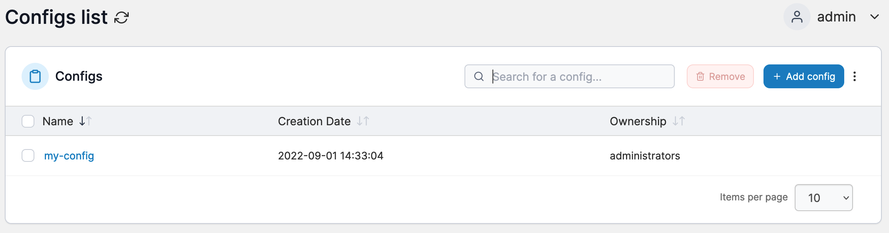

# Configs


The **Configs** menu is only available to Docker Swarm environments.


Docker 17.06 introduced swarm service configs which allow you to store non-sensitive information, such as configuration files, outside a service’s image or running containers. This allows you to keep your images as generic as possible, without the need to bind-mount configuration files into the containers or use environment variables. [Secrets](../secrets/) is another option for storing sensitive information.

<figure><figcaption></figcaption></figure>

In Portainer you can add and remove custom configurations for use in deployments.


[add.md](add.md)



[remove.md](remove.md)


