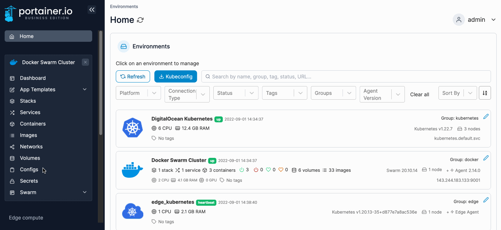
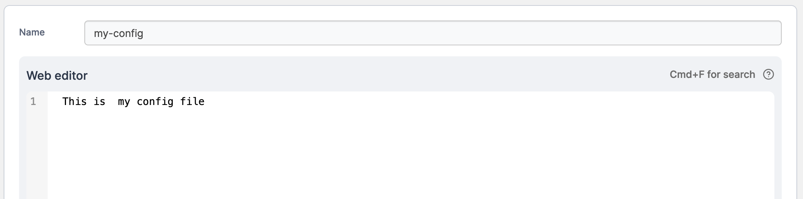

# Add a new config

From the menu select **Configs** then click **Add config**.

<figure><figcaption></figcaption></figure>

&#x20;In the editor, write the configuration. You can also add labels and configure access control.

<figure><figcaption></figcaption></figure>

When you're finished, click **Create config**.

