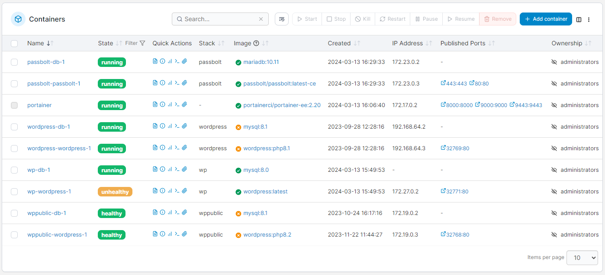

# Containers

Put simply, a container is a runnable instance of an image. Containers do not hold any persistent data and therefore can be destroyed and recreated as needed.

<figure><figcaption></figcaption></figure>

When the [new image indicator](../host/setup.md#other) feature is enabled, the **Images up to date** column indicates whether the local images in the container are up to date, with a green tick indicating they are up to date and an orange cross indicating that there is a newer version of an image available at the remote registry. A grey hyphen indicates Portainer was unable to determine whether there is an update available for the images.

You can click the reload button next to the search box to recheck the images for all your containers for updates, or to recheck a single container's image you can click the image indicator icon for that container.

For more on how this works, have a look at [this knowledge base article](https://portal.portainer.io/knowledge/how-does-the-image-update-notification-icon-work).

To add a new container, click **Add container**.


[add.md](add.md)


Once a container has been created you can inspect it, edit or duplicate it, toggle a container webhook, attach volumes, view logs and statistics, edit ownership, and access its console.


[view.md](view.md)



[inspect.md](inspect.md)



[edit.md](edit.md)



[advanced.md](advanced.md)



[webhooks.md](webhooks.md)



[attach-volume.md](attach-volume.md)



[logs.md](logs.md)



[ownership.md](ownership.md)



[stats.md](stats.md)



[console.md](console.md)


If you no longer need a container, you can remove it.


[remove.md](remove.md)


