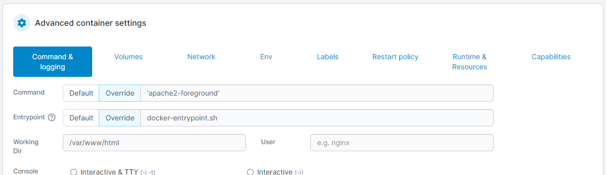
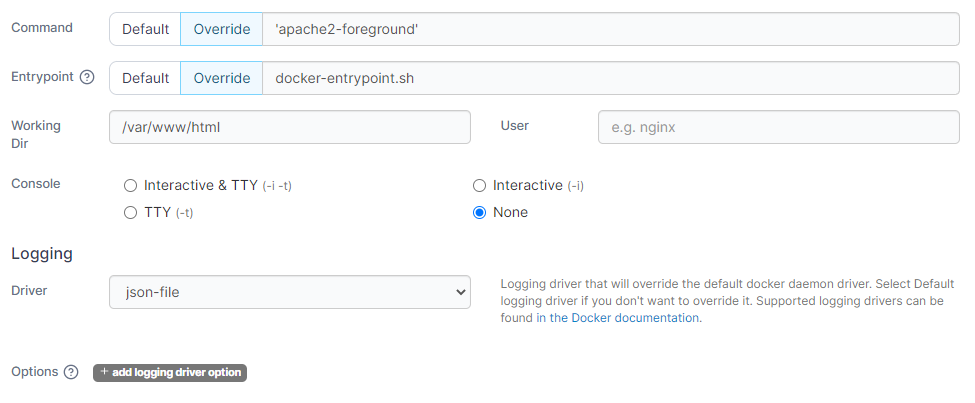
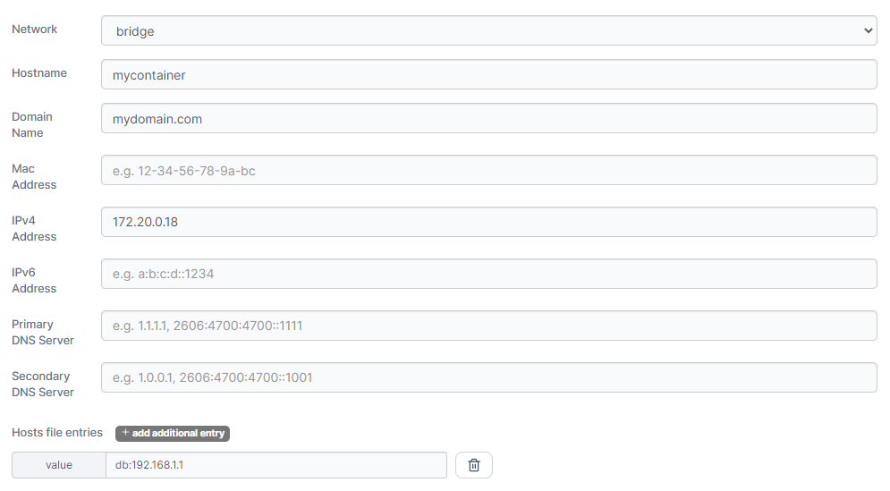
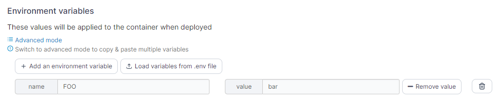
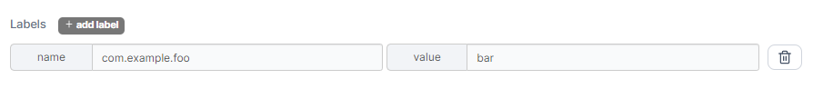
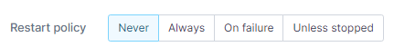
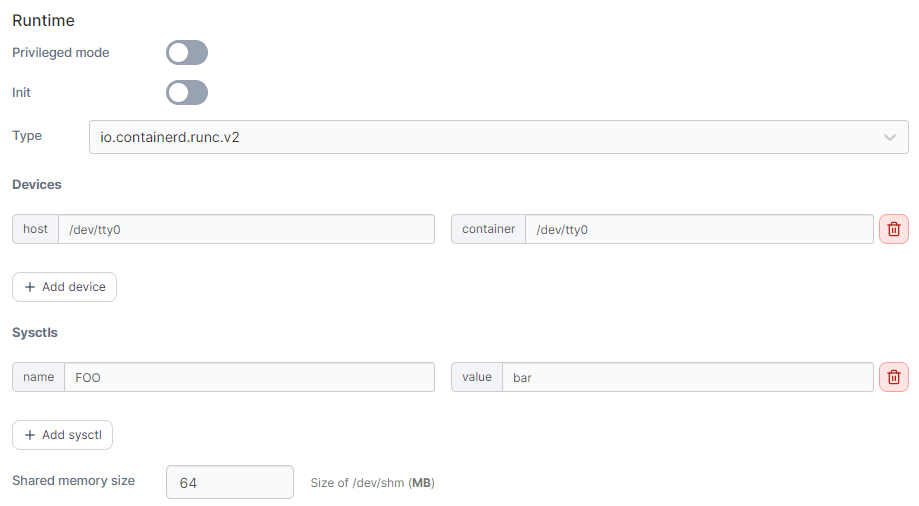
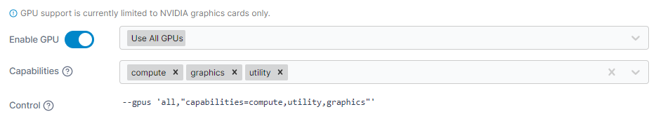
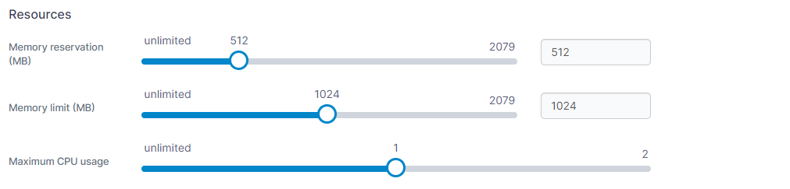
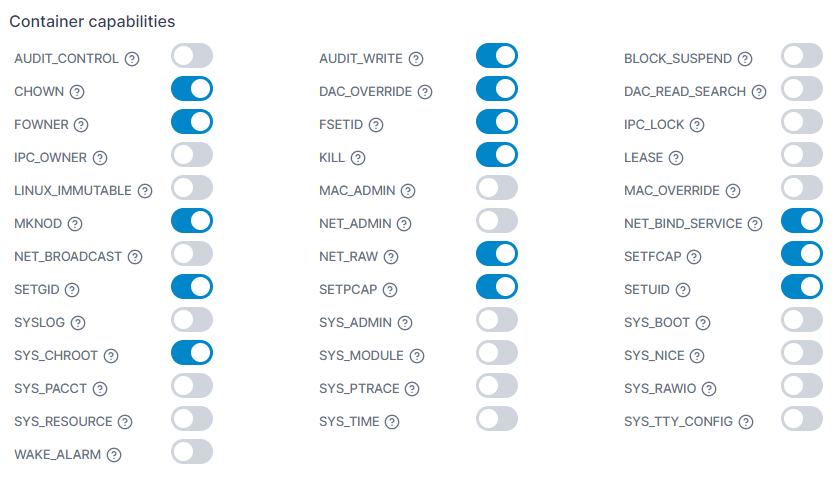

# Advanced container settings

When creating or editing a container you can configure a number of additional settings in the **Advanced container settings** section.

<figure><figcaption></figcaption></figure>

## Command & logging

In this section you can configure the command that runs when the container starts as well as configure logging for the container.

| Field/Option | Overview                                                                                                                                                                                                        |
| ------------ | --------------------------------------------------------------------------------------------------------------------------------------------------------------------------------------------------------------- |
| Command      | Set the command that is run when the container starts. Select `Default` to use the default command provided by the container's image, or select `Override` and provide a command to override the default value. |
| Entrypoint   | Set the entrypoint for the container. Select `Default` to use the default entrypoint provided by the container's image, or select `Override` and provide an entrypoint to override the default value.           |
| Working Dir  | Set the working directory your container should start in (within the container's filesystem).                                                                                                                   |
| User         | Specify the user that the container's command should run as.                                                                                                                                                    |
| Console      | Set the console configuration for your container.                                                                                                                                                               |
| Driver       | Select the logging driver to use for your container. Available options will depend on the logging drivers configured on your Docker host.                                                                       |
| Options      | Set additional options for your logging driver. To add a new option click **add logging driver option** and configure accordingly.                                                                              |

<figure><figcaption></figcaption></figure>

## Volumes

Here you can configure volume mappings for your container. You can map to [existing named volumes](../volumes/) or bind mount to locations on your Docker host.

| Field/Option         | Overview                                                                                                                                                            |
| -------------------- | ------------------------------------------------------------------------------------------------------------------------------------------------------------------- |
| Container path       | Specify where you want to make the volume or bind mount available within the container's filesystem.                                                                |
| Mapping type         | Select `Volume` to map a named volume, or select `Bind` to map a bind mount.                                                                                        |
| Volume               | If using the `Volume` mapping type, select the named volume to mount from the dropdown.                                                                             |
| Host path            | If using the `Bind` mapping type, specify the path on the Docker host you want to bind mount in the container.                                                      |
| Writable / Read-only | Select `Writable` if you want the container to be able to write to the mapping. Select `Read-only` if the container should **not** be able to write to the mapping. |

<figure><figcaption></figcaption></figure>

## Network

In this section you can configure the network settings for the container.&#x20;


Note that you cannot assign a static IP address to a container that is in Docker's default `bridge` network. This is a Docker limitation rather than Portainer. If you need to specify the IP for your container then you will need to [create a custom network](../networks/add.md) and assign the container to it.


| Field/Option         | Overview                                                                                                                                                                        |
| -------------------- | ------------------------------------------------------------------------------------------------------------------------------------------------------------------------------- |
| Network              | Select the [network](../networks/) to attach the container to from the dropdown.                                                                                                |
| Hostname             | Specify the hostname for the container.                                                                                                                                         |
| Domain Name          | Specify the domain name for the container.                                                                                                                                      |
| Mac Address          | Specify the MAC address to set on the container.                                                                                                                                |
| IPv4 Address         | Specify the IPv4 address to use for the container. This must be within the range for the chosen network and should not be already assigned to a container.                      |
| IPv6 Address         | Specify the IPv6 address to use for the container. This must be within the range for the chosen network and should not be already assigned to a container.                      |
| Primary DNS Server   | Specify the primary DNS server to use within the container.                                                                                                                     |
| Secondary DNS Server | Specify the secondary DNS server to use within the container.                                                                                                                   |
| Hosts file entries   | Click **add additional entry** to add a new host file entry for the container. Host file values should be formatted as `hostname:address` (for example `database:192.168.1.1`). |

<figure><figcaption></figcaption></figure>

## Env

Use this section to add or edit environment variables made available in the container. Click **Add an environment variable** to create a new variable, or edit an existing variable with the fields provided. You can also click **Load variables from .env file** to import an existing .env file with your variables. To remove a variable, click the trash can icon to the right of the variable to remove.

| Field/Option | Overview                                    |
| ------------ | ------------------------------------------- |
| Name         | Set the name for the environment variable.  |
| Value        | Set the value for the environment variable. |

<figure><figcaption></figcaption></figure>

If you want to add multiple variables at once, click on **Advanced mode** to switch to an editor view where you can paste a block of variables and values.

## Labels

You can set labels on your container using this section. Click add label to add a new label, or edit an existing label using the fields provided. To remove a label, click the trash can icon to the right of the label to remove.

| Field/Option | Overview                     |
| ------------ | ---------------------------- |
| Name         | Set the name for the label.  |
| Value        | Set the value for the label. |

<figure><figcaption></figcaption></figure>

## Restart policy

Use this section to configure the restart policy for your container. Possible options are:

* **Never**: Do not automatically restart the container when it exits. This is the default.
* **Always**: Always restart the container regardless of the exit status. When you specify always, Docker will try to restart the container indefinitely. The container will also always start on Docker startup, regardless of the current state of the container.
* **On failure**: Restart only if the container exits with a non-zero exit status.
* **Unless stopped**: Always restart the container regardless of the exit status, including on Docker startup, except if the container was put into a stopped state before Docker was stopped.

<figure><figcaption></figcaption></figure>

## Runtime & Resources

This section lets you configure runtime options for your container, add or configure GPUs for use within the container, and specify resource limitations on the container.

### Runtime

Here you can configure runtime options for the container.

| Field/Option       | Overview                                                                                                                                                                                                                                                           |
| ------------------ | ------------------------------------------------------------------------------------------------------------------------------------------------------------------------------------------------------------------------------------------------------------------ |
| Privileged mode    | Enable this option to run the container in [privileged mode](https://docs.docker.com/engine/reference/run/#runtime-privilege-and-linux-capabilities).                                                                                                              |
| Init               | Enable this option to tell Docker that an init process should be used as PID 1 in the container.                                                                                                                                                                   |
| Type               | Select the runtime type to use to start the container. Options will depend on available runtimes on your Docker host.                                                                                                                                              |
| Devices            | Use this option to make devices on your Docker host available within the container. Click **add device** to add a new device, and define the **host** path for the device and the **container** path for where you want the device to appear within the container. |
| Sysctls            | Use this option to specify sysctls to make available within the container. Click **add sysctl** to add a new sysctl, and set the **name** and **value** for your sysctl as required.                                                                               |
| Shared memory size | Specify the size (in MB) of the shared memory device (`/dev/shm`) for the container.                                                                                                                                                                               |

<figure><figcaption></figcaption></figure>

### GPU

Here you can enable GPU access for the container and configure the GPU settings as required.


GPU support is currently only available on Docker Standalone environments, and only supports NVIDIA GPUs.


| Field/Option | Overview                                                                                                                                                            |
| ------------ | ------------------------------------------------------------------------------------------------------------------------------------------------------------------- |
| Enable GPU   | Toggle this option on to enable GPU access for the container.                                                                                                       |
| GPU selector | Select the GPU(s) to make available to the container, or choose `Use All GPUs` to provide access to all the GPUs on the Docker host.                                |
| Capabilities | Select the capabilities you want to use with the container. Portainer preselects `compute` and `utility` as they are the defaults when not specifying capabilities. |
| Control      | View a generated equivalent of the Docker CLI's `--gpus` option based on your selections above.                                                                     |

<figure><figcaption></figcaption></figure>

### Resources

Here you can configure resource limits for your container. You can use the sliders to set the value or enter a value in the fields.

| Field/Option            | Overview                                                                                                                                                      |
| ----------------------- | ------------------------------------------------------------------------------------------------------------------------------------------------------------- |
| Memory reservation (MB) | Specify the amount of memory (in MB) to reserve for the container.                                                                                            |
| Memory limit (MB)       | Specify the maximum amount of memory (in MB) the container is allowed to use.                                                                                 |
| Maximum CPU usage       | Specify the maximum amount of CPU the container is allowed to use. This is specified based on the number of processing threads available on your Docker host. |

<figure><figcaption></figcaption></figure>

## Capabilities

In this section you can configure the individual capabilities for your container. For more information refer to the [Docker documentation](https://docs.docker.com/engine/reference/run/#runtime-privilege-and-linux-capabilities).

<figure><figcaption></figcaption></figure>
